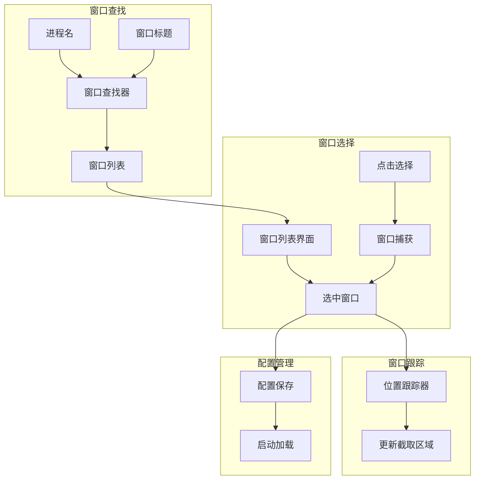

# 设计文档

## 概述

本设计文档描述自动游戏窗口检测功能的技术实现方案。通过 Windows API 自动检测游戏窗口的位置和大小，支持窗口跟踪和配置保存，无需手动配置窗口区域坐标。

## 架构



## 组件和接口

### 1. 窗口查找器 (WindowFinder)

```python
class 窗口查找器:
    """查找和定位游戏窗口"""
    
    def __init__(self):
        pass
    
    def 按进程名查找(self, 进程名: str) -> list:
        """
        通过进程名查找窗口
        
        参数:
            进程名: 进程名称（如 "game.exe"）
            
        返回:
            匹配的窗口信息列表
        """
        pass

    def 按标题查找(self, 标题: str, 模糊匹配: bool = True) -> list:
        """
        通过窗口标题查找窗口
        
        参数:
            标题: 窗口标题（支持部分匹配）
            模糊匹配: 是否启用模糊匹配
            
        返回:
            匹配的窗口信息列表
        """
        pass
    
    def 获取所有窗口(self, 仅可见: bool = True) -> list:
        """
        获取所有窗口列表
        
        参数:
            仅可见: 是否只返回可见窗口
            
        返回:
            窗口信息列表
        """
        pass
    
    def 获取窗口信息(self, 句柄: int) -> dict:
        """
        获取指定窗口的详细信息
        
        参数:
            句柄: 窗口句柄
            
        返回:
            窗口信息字典
        """
        pass
    
    def 获取窗口缩略图(self, 句柄: int, 大小: tuple = (200, 150)) -> np.ndarray:
        """获取窗口缩略图"""
        pass
```

### 2. 窗口跟踪器 (WindowTracker)

```python
class 窗口跟踪器:
    """跟踪窗口位置变化"""
    
    def __init__(self, 句柄: int, 回调: callable = None):
        """
        初始化跟踪器
        
        参数:
            句柄: 要跟踪的窗口句柄
            回调: 位置变化时的回调函数
        """
        pass
    
    def 启动(self):
        """启动位置跟踪（后台线程）"""
        pass
    
    def 停止(self):
        """停止位置跟踪"""
        pass
    
    def 获取当前位置(self) -> tuple:
        """
        获取窗口当前位置
        
        返回:
            (x, y, width, height)
        """
        pass
    
    def 窗口是否存在(self) -> bool:
        """检查窗口是否仍然存在"""
        pass
    
    def 窗口是否移动(self) -> bool:
        """检查窗口是否移动"""
        pass
    
    def 窗口是否调整大小(self) -> bool:
        """检查窗口是否调整大小"""
        pass
```

### 3. 窗口选择器 (WindowSelector)

```python
class 窗口选择器:
    """窗口选择界面"""
    
    def __init__(self, 查找器: 窗口查找器):
        pass
    
    def 显示列表(self, 过滤关键词: str = None) -> int:
        """
        显示窗口列表供用户选择
        
        参数:
            过滤关键词: 过滤窗口的关键词
            
        返回:
            选中的窗口句柄
        """
        pass
    
    def 点击选择模式(self, 倒计时: int = 3) -> int:
        """
        启动点击选择模式
        
        参数:
            倒计时: 进入选择模式前的倒计时秒数
            
        返回:
            选中的窗口句柄
        """
        pass
    
    def 确认选择(self, 句柄: int) -> bool:
        """
        确认窗口选择
        
        参数:
            句柄: 窗口句柄
            
        返回:
            用户是否确认
        """
        pass
```

### 4. 窗口配置管理器 (WindowConfigManager)

```python
class 窗口配置管理器:
    """管理窗口配置的保存和加载"""
    
    def __init__(self, 配置路径: str = "配置/窗口配置.json"):
        pass
    
    def 保存配置(self, 窗口标识: str, 窗口信息: dict):
        """
        保存窗口配置
        
        参数:
            窗口标识: 窗口标识符（进程名或标题）
            窗口信息: 窗口信息字典
        """
        pass
    
    def 加载配置(self, 窗口标识: str = None) -> dict:
        """
        加载窗口配置
        
        参数:
            窗口标识: 窗口标识符，None 表示加载默认配置
            
        返回:
            窗口配置字典
        """
        pass
    
    def 获取所有配置(self) -> list:
        """获取所有保存的窗口配置"""
        pass
    
    def 删除配置(self, 窗口标识: str):
        """删除指定窗口配置"""
        pass
    
    def 设置默认(self, 窗口标识: str):
        """设置默认窗口配置"""
        pass
```

## 数据模型

### 窗口信息

```python
@dataclass
class 窗口信息:
    句柄: int
    标题: str
    进程名: str
    进程ID: int
    位置: tuple  # (x, y)
    大小: tuple  # (width, height)
    是否可见: bool
    是否最小化: bool
```

### 窗口配置

```python
窗口配置 = {
    "默认": "game.exe",
    "配置列表": {
        "game.exe": {
            "标识类型": "process",  # process / title
            "标识值": "game.exe",
            "上次位置": [100, 100, 1920, 1080],
            "上次使用": "2026-01-03T10:00:00"
        },
        "某游戏": {
            "标识类型": "title",
            "标识值": "某游戏",
            "上次位置": [0, 0, 1280, 720],
            "上次使用": "2026-01-02T15:30:00"
        }
    }
}
```

## 正确性属性

### 属性 1: 窗口唯一性

*对于任意* 返回的窗口句柄，应对应一个有效的窗口

**验证: 需求 1.3**

### 属性 2: 位置准确性

*对于任意* 获取的窗口位置，应与实际窗口位置一致（误差 < 1 像素）

**验证: 需求 3.2**

### 属性 3: 配置持久性

*对于任意* 保存的窗口配置，重新加载后应与保存时一致

**验证: 需求 4.1**

## 错误处理

| 错误场景 | 处理策略 |
|---------|---------|
| 未找到匹配窗口 | 返回空列表并提示用户 |
| 窗口已关闭 | 通知用户重新选择 |
| 配置文件损坏 | 使用默认配置 |
| 权限不足 | 提示以管理员运行 |

## 测试策略

### 单元测试
- 测试窗口查找功能
- 测试配置保存/加载
- 测试位置跟踪

### 属性测试
- 属性 1: 验证返回句柄有效性
- 属性 2: 对比获取位置与实际位置
- 属性 3: 随机配置保存/加载验证
