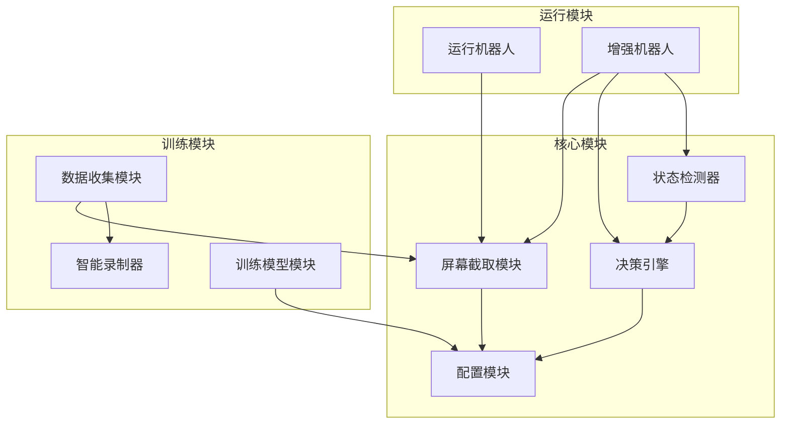
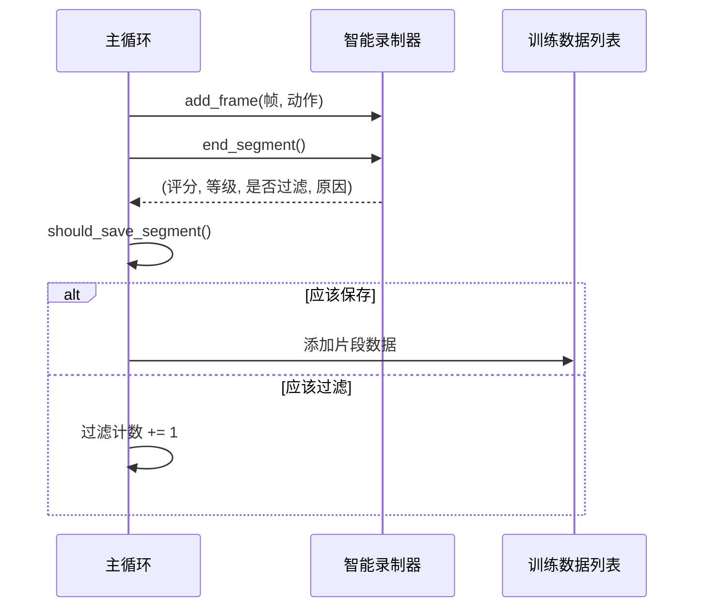

# 设计文档

## 概述

本设计文档描述了修复 MMORPG 游戏 AI 助手项目中业务逻辑问题的技术方案。修复涉及 8 个主要问题，按优先级分为高、中、低三个级别进行处理。

## 架构

修复工作主要涉及以下模块的修改：



## 组件和接口

### 1. 屏幕截取模块修复

**文件**: `核心/屏幕截取.py`

**修改点**:
- `截取屏幕` 函数：添加 `region` 参数别名支持
- `_标准GDI截取` 函数：修复宽高计算公式

**接口变更**:
```python
def 截取屏幕(区域=None, region=None, 使用优化=True):
    """
    截取屏幕指定区域
    
    参数:
        区域: tuple (左, 上, 右, 下) 或 None (全屏)
        region: 区域的别名，保持向后兼容
        使用优化: 是否使用优化截取器
    """
    # 优先使用 区域 参数，如果未提供则使用 region
    实际区域 = 区域 if 区域 is not None else region
```

### 2. 智能录制数据过滤修复

**文件**: `训练/收集数据.py`

**修改点**:
- 主程序循环中的数据添加逻辑
- 添加片段级别的过滤判断

**数据流**:


### 3. GDI 截取宽高修复

**文件**: `核心/屏幕截取.py`

**修改点**:
```python
# 修复前
宽度 = 右 - 左 + 1
高度 = 下 - 上 + 1

# 修复后
宽度 = 右 - 左
高度 = 下 - 上
```

### 4. 动作索引冲突修复

**文件**: `配置/设置.py`

**修改点**:
- 将动作索引 21 的"交互"按键从 "F" 改为 "G"
- 添加按键冲突检测函数

### 5. 配置同步修复

**文件**: `配置/设置.py`

**修改点**:
```python
def 更新窗口区域(新区域: tuple):
    global 游戏窗口区域, 游戏宽度, 游戏高度, 模型输入宽度, 模型输入高度
    
    if 新区域 and len(新区域) == 4:
        x, y, width, height = 新区域
        游戏窗口区域 = (x, y, x + width, y + height)
        游戏宽度 = width
        游戏高度 = height
        # 同步更新模型输入尺寸
        模型输入宽度 = 游戏宽度 // 模型缩放比例
        模型输入高度 = 游戏高度 // 模型缩放比例
```

### 6. 训练类别权重修复

**文件**: `训练/训练模型.py`

**修改点**:
- 确保加权损失函数被传递给模型训练
- 在模型编译时使用自定义损失函数

### 7. 训练 Loss 值获取修复

**文件**: `训练/训练模型.py`

**修改点**:
- 使用 TFLearn 回调获取实际 loss 值
- 更新检查点保存逻辑

### 8. 血量检测集成

**文件**: `运行/增强机器人.py`

**修改点**:
- 集成状态检测器获取血量
- 更新决策上下文创建逻辑

## 数据模型

### 片段过滤状态

```python
@dataclass
class 片段过滤结果:
    评分: float           # 0-100 的价值评分
    等级: str             # "high", "medium", "low"
    是否过滤: bool        # True 表示应该被过滤
    过滤原因: List[str]   # 过滤原因列表
    帧数据: List[np.ndarray]  # 片段中的帧
    动作数据: List[int]   # 片段中的动作
```

### 配置同步事件

```python
@dataclass
class 配置变更事件:
    变更类型: str         # "窗口区域", "模型尺寸" 等
    旧值: Any
    新值: Any
    时间戳: float
```


## 正确性属性

*正确性属性是系统在所有有效执行中应保持为真的特征或行为——本质上是关于系统应该做什么的形式化陈述。属性作为人类可读规范和机器可验证正确性保证之间的桥梁。*

### 属性 1: 参数名称等价性

*对于任意*有效的屏幕区域，使用参数名"区域"和"region"调用截取屏幕函数应产生相同的结果。

**验证: 需求 1.3, 1.4**

### 属性 2: 过滤逻辑一致性

*对于任意*片段评估结果，当 should_filter=True 或 (等级="low" 且 过滤选项="auto_filter") 时，该片段不应出现在最终的训练数据列表中。

**验证: 需求 2.1, 2.2**

### 属性 3: 过滤模式正确性

*对于任意*片段集合和过滤选项：
- 当选项为"high_only"时，结果列表中所有片段的等级都应为"high"
- 当选项为"all"时，结果列表应包含所有输入片段

**验证: 需求 2.3, 2.4**

### 属性 4: 统计准确性

*对于任意*录制会话，过滤计数 + 保存计数 应等于总片段数。

**验证: 需求 2.5**

### 属性 5: 截取尺寸正确性

*对于任意*有效区域 (左, 上, 右, 下)，截取返回的图像尺寸应为 (右-左, 下-上)。

**验证: 需求 3.1, 3.2, 3.3**

### 属性 6: 按键映射唯一性

*对于任意*动作定义集合，不应存在两个不同的动作索引映射到相同的按键。

**验证: 需求 4.1**

### 属性 7: 模型输入尺寸同步

*对于任意*窗口区域更新，更新后的模型输入宽度应等于 游戏宽度 // 模型缩放比例，模型输入高度应等于 游戏高度 // 模型缩放比例。

**验证: 需求 5.1, 5.2, 5.3**

### 属性 8: 血量检测集成

*对于任意*决策上下文创建，当状态检测器返回有效血量时，决策上下文中的血量百分比应等于检测器返回值；当检测失败时，应回退到 1.0。

**验证: 需求 8.1, 8.3**

### 属性 9: 紧急规则触发

*对于任意*血量百分比值，当血量低于紧急阈值时，决策引擎应触发紧急规则。

**验证: 需求 8.4**

## 错误处理

### 屏幕截取错误
- 当截取失败时，记录错误并返回 None
- 当区域参数无效时，抛出 ValueError

### 配置错误
- 当检测到按键冲突时，记录警告但继续加载
- 当窗口区域无效时，保持原有配置不变

### 训练错误
- 当类别权重计算失败时，回退到默认损失函数
- 当 loss 值获取失败时，记录警告并使用估计值

### 血量检测错误
- 当状态检测器不可用时，使用默认值 1.0
- 当检测返回无效值时，记录警告并使用上一次有效值

## 测试策略

### 单元测试
- 测试参数别名功能
- 测试 GDI 截取尺寸计算
- 测试按键冲突检测
- 测试配置同步逻辑
- 测试过滤逻辑

### 属性测试
- 使用 Hypothesis 库进行属性测试
- 每个属性测试运行至少 100 次迭代
- 测试标签格式: **Feature: business-logic-fixes, Property {number}: {property_text}**

### 集成测试
- 测试数据收集流程的完整过滤逻辑
- 测试增强机器人的血量检测集成
- 测试训练模块的类别权重应用
