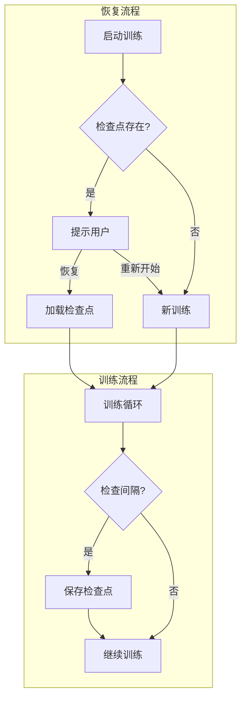

# 设计文档

## 概述

本设计文档描述断点续训功能的技术实现方案。通过在训练过程中定期保存检查点，支持训练中断后从上次中断处继续训练。

## 架构



## 组件和接口

### 1. 检查点管理器 (CheckpointManager)

```python
class 检查点管理器:
    """管理训练检查点的保存和加载"""
    
    def __init__(self, 保存目录: str, 最大检查点数: int = 5):
        """
        初始化检查点管理器
        
        参数:
            保存目录: 检查点保存目录
            最大检查点数: 保留的最大检查点数量
        """
        pass
    
    def 保存检查点(self, 模型, 优化器状态: dict, 
                   当前epoch: int, 当前batch: int,
                   loss值: float) -> str:
        """
        保存训练检查点
        
        返回:
            检查点文件路径
        """
        pass
    
    def 加载检查点(self, 检查点路径: str = None) -> dict:
        """
        加载检查点
        
        参数:
            检查点路径: 指定检查点路径，None 则加载最新
            
        返回:
            检查点数据字典
        """
        pass
    
    def 列出检查点(self) -> List[dict]:
        """
        列出所有可用检查点及其元数据
        
        返回:
            检查点信息列表
        """
        pass
    
    def 删除旧检查点(self) -> int:
        """删除超出数量限制的旧检查点"""
        pass
```

### 2. 训练状态 (TrainingState)

```python
@dataclass
class 训练状态:
    """训练状态数据类"""
    模型权重: dict
    优化器状态: dict
    当前epoch: int
    当前batch: int
    总epoch: int
    loss历史: List[float]
    最佳loss: float
    随机种子: int
```

### 3. 检查点元数据 (CheckpointMetadata)

```python
@dataclass
class 检查点元数据:
    """检查点元数据"""
    文件路径: str
    创建时间: datetime
    epoch: int
    batch: int
    loss值: float
    文件大小: int  # 字节
```

## 数据模型

### 检查点文件结构

```
检查点目录/
├── checkpoint_epoch_001_batch_0500.pt
├── checkpoint_epoch_002_batch_0000.pt
├── checkpoint_epoch_003_batch_0000.pt
├── checkpoint_latest.pt -> checkpoint_epoch_003_batch_0000.pt
└── metadata.json
```

### 检查点数据格式

```python
检查点数据 = {
    "版本": "1.0",
    "模型权重": {...},
    "优化器状态": {...},
    "训练进度": {
        "当前epoch": 3,
        "当前batch": 0,
        "总epoch": 10,
    },
    "指标": {
        "loss": 0.234,
        "最佳loss": 0.198,
    },
    "元数据": {
        "创建时间": "2026-01-03T10:30:00",
        "随机种子": 42,
    }
}
```

## 正确性属性

### 属性 1: 检查点保存完整性

*对于任意* 保存的检查点，加载后应能完全恢复训练状态，包括模型权重、优化器状态和训练进度

**验证: 需求 1.2, 2.3**

### 属性 2: 检查点数量限制

*对于任意* 时刻，检查点目录中的检查点数量应不超过配置的最大值

**验证: 需求 1.4**

### 属性 3: 恢复训练连续性

*对于任意* 从检查点恢复的训练，恢复后的第一个 batch 应紧接着中断时的最后一个 batch

**验证: 需求 2.5**

## 错误处理

| 错误场景 | 处理策略 |
|---------|---------|
| 检查点文件损坏 | 尝试加载上一个检查点 |
| 磁盘空间不足 | 删除最旧的检查点后重试 |
| 模型结构不匹配 | 返回错误，建议重新训练 |
| 保存目录不存在 | 自动创建目录 |

## 测试策略

### 单元测试
- 测试检查点保存和加载
- 测试元数据记录
- 测试旧检查点清理

### 属性测试
- 属性 1: 保存后立即加载，验证状态一致性
- 属性 2: 连续保存多个检查点，验证数量限制
- 属性 3: 模拟中断恢复，验证 batch 连续性
