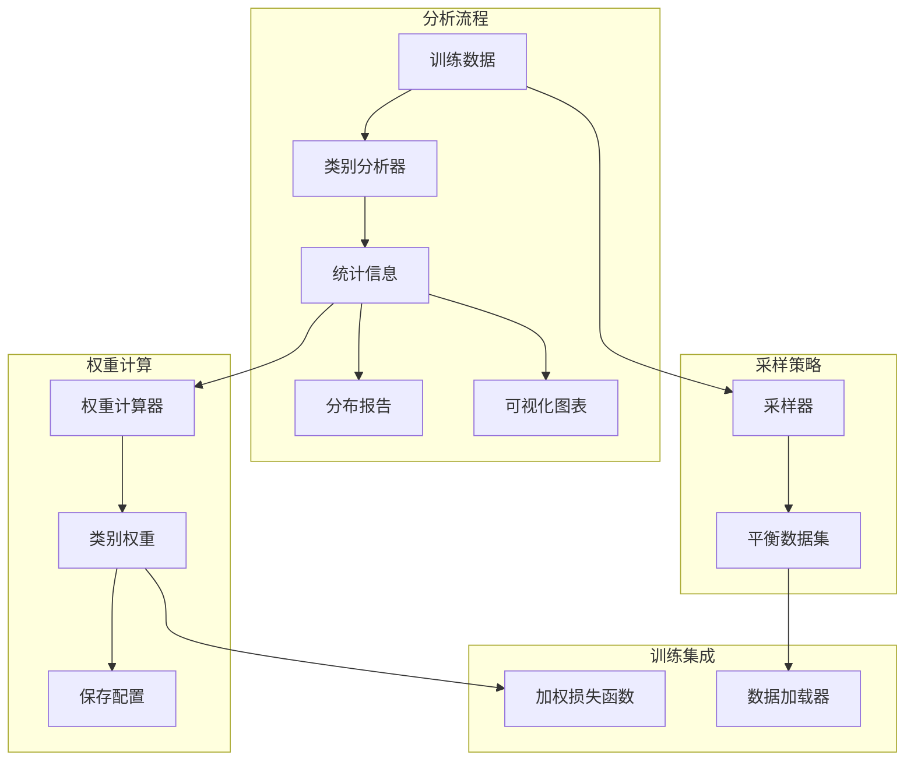

# 设计文档

## 概述

本设计文档描述类别权重平衡功能的技术实现方案。通过分析训练数据中的类别分布，计算类别权重或应用采样策略，解决动作类别不平衡问题，提高模型对少数类别的学习效果。

## 架构



## 组件和接口

### 1. 类别分析器 (ClassAnalyzer)

```python
class 类别分析器:
    """分析训练数据中的类别分布"""
    
    def __init__(self, 数据路径: str):
        """
        初始化分析器
        
        参数:
            数据路径: 训练数据目录路径
        """
        pass
    
    def 统计分布(self) -> dict:
        """
        统计各类别样本数量
        
        返回:
            {类别名: 样本数} 字典
        """
        pass
    
    def 计算不平衡比率(self) -> float:
        """
        计算不平衡比率
        
        返回:
            最大类别数量 / 最小类别数量
        """
        pass
    
    def 识别欠代表类别(self, 阈值: float = 0.05) -> list:
        """
        识别严重欠代表的类别
        
        参数:
            阈值: 相对于最大类别的比例阈值
            
        返回:
            欠代表类别列表
        """
        pass
    
    def 生成报告(self) -> str:
        """生成类别分布分析报告"""
        pass
    
    def 可视化(self, 保存路径: str = None):
        """生成类别分布柱状图"""
        pass
```

### 2. 权重计算器 (WeightCalculator)

```python
class 权重计算器:
    """计算类别权重"""
    
    class 策略(Enum):
        逆频率 = "inverse_frequency"
        平方根逆频率 = "sqrt_inverse_frequency"
        有效样本数 = "effective_samples"
    
    def __init__(self, 类别统计: dict, 策略: 策略 = 策略.逆频率):
        """
        初始化权重计算器
        
        参数:
            类别统计: {类别名: 样本数} 字典
            策略: 权重计算策略
        """
        pass
    
    def 计算权重(self) -> dict:
        """
        计算类别权重
        
        返回:
            {类别名: 权重} 字典
        """
        pass
    
    def 归一化权重(self, 权重: dict) -> dict:
        """
        归一化权重使平均值为 1.0
        
        参数:
            权重: 原始权重字典
            
        返回:
            归一化后的权重字典
        """
        pass
    
    def 保存权重(self, 配置路径: str):
        """保存权重到配置文件"""
        pass
    
    def 加载权重(self, 配置路径: str) -> dict:
        """从配置文件加载权重"""
        pass
```

### 3. 采样器 (Sampler)

```python
class 采样器:
    """数据采样策略"""
    
    def __init__(self, 数据集, 类别统计: dict):
        pass
    
    def 随机过采样(self, 目标比率: float = 1.0):
        """
        对少数类别进行随机过采样
        
        参数:
            目标比率: 目标平衡比率
            
        返回:
            平衡后的数据集
        """
        pass
    
    def 增强过采样(self, 目标比率: float = 1.0):
        """
        对少数类别进行增强过采样（类似 SMOTE）
        
        参数:
            目标比率: 目标平衡比率
            
        返回:
            平衡后的数据集
        """
        pass
    
    def 随机欠采样(self, 最大样本数: int = None):
        """
        对多数类别进行随机欠采样
        
        参数:
            最大样本数: 每个类别的最大样本数
            
        返回:
            平衡后的数据集
        """
        pass
    
    def 知情欠采样(self, 最大样本数: int = None):
        """
        对多数类别进行知情欠采样（保留多样化样本）
        
        参数:
            最大样本数: 每个类别的最大样本数
            
        返回:
            平衡后的数据集
        """
        pass
```

### 4. 加权损失函数 (WeightedLoss)

```python
class 加权交叉熵损失:
    """带类别权重的交叉熵损失函数"""
    
    def __init__(self, 类别权重: dict, 设备: str = "cuda"):
        """
        初始化加权损失函数
        
        参数:
            类别权重: {类别索引: 权重} 字典
            设备: 计算设备
        """
        pass
    
    def __call__(self, 预测: torch.Tensor, 标签: torch.Tensor) -> torch.Tensor:
        """
        计算加权损失
        
        参数:
            预测: 模型预测输出
            标签: 真实标签
            
        返回:
            加权损失值
        """
        pass
```

## 数据模型

### 类别统计

```python
@dataclass
class 类别统计:
    类别名称: str
    样本数量: int
    占比: float
    是否欠代表: bool
```

### 平衡配置

```python
平衡配置 = {
    "策略": "inverse_frequency",  # 权重计算策略
    "类别权重": {
        "无操作": 0.5,
        "攻击": 2.0,
        "技能1": 3.0,
        "技能2": 2.5,
        "移动": 1.0
    },
    "采样": {
        "启用": False,
        "方法": "oversample",  # oversample / undersample
        "目标比率": 0.5
    }
}
```

### 分析报告

```python
@dataclass
class 分析报告:
    总样本数: int
    类别数量: int
    不平衡比率: float
    最大类别: str
    最小类别: str
    欠代表类别: list
    建议: list
```

## 正确性属性

### 属性 1: 权重归一化

*对于任意* 类别权重集合，归一化后的平均权重应等于 1.0

**验证: 需求 2.3**

### 属性 2: 过采样平衡

*对于任意* 过采样后的数据集，各类别样本数量差异应在目标比率范围内

**验证: 需求 4.3**

### 属性 3: 欠采样上限

*对于任意* 欠采样后的数据集，每个类别样本数不应超过配置的最大值

**验证: 需求 5.3**

## 错误处理

| 错误场景 | 处理策略 |
|---------|---------|
| 数据目录为空 | 抛出异常并提示 |
| 类别数量为 1 | 警告并跳过平衡 |
| 权重配置无效 | 使用默认权重 (1.0) |
| 采样后数据为空 | 回退到原始数据 |

## 测试策略

### 单元测试
- 测试类别统计准确性
- 测试权重计算各策略
- 测试采样后数据分布

### 属性测试
- 属性 1: 生成随机类别分布，验证归一化
- 属性 2: 生成不平衡数据，验证过采样效果
- 属性 3: 生成大数据集，验证欠采样上限
