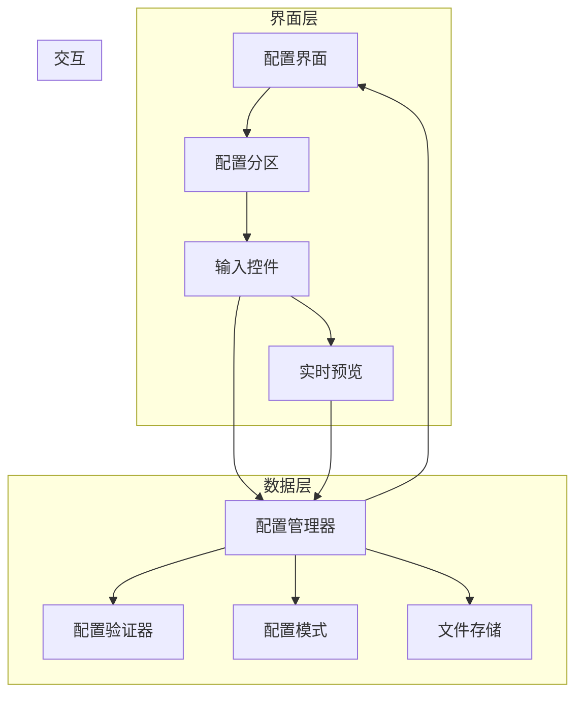

# 设计文档

## 概述

本设计文档描述配置界面优化功能的技术实现方案。提供图形化配置界面，让用户无需修改代码即可调整各项配置参数，支持配置验证、实时预览和多档案管理。

## 架构



## 组件和接口

### 1. 配置管理器 (ConfigManager)

```python
class 配置管理器:
    """管理配置的加载、保存和验证"""
    
    def __init__(self, 模式定义: dict = None):
        """
        初始化配置管理器
        
        参数:
            模式定义: 配置模式定义
        """
        pass
    
    def 加载配置(self, 配置路径: str) -> dict:
        """
        从文件加载配置
        
        参数:
            配置路径: 配置文件路径
            
        返回:
            配置字典
        """
        pass

    def 保存配置(self, 配置: dict, 配置路径: str):
        """
        保存配置到文件
        
        参数:
            配置: 配置字典
            配置路径: 配置文件路径
        """
        pass
    
    def 验证配置(self, 配置: dict) -> tuple:
        """
        验证配置有效性
        
        返回:
            (是否有效, 错误列表)
        """
        pass
    
    def 获取默认值(self, 参数名: str = None) -> any:
        """
        获取参数默认值
        
        参数:
            参数名: 参数名称，None 表示获取所有默认值
        """
        pass
    
    def 重置为默认(self, 分区: str = None) -> dict:
        """
        重置配置为默认值
        
        参数:
            分区: 分区名称，None 表示重置所有
        """
        pass
    
    def 导出配置(self, 配置: dict, 导出路径: str):
        """导出配置到文件"""
        pass
    
    def 导入配置(self, 导入路径: str) -> dict:
        """从文件导入配置"""
        pass
```

### 2. 配置验证器 (ConfigValidator)

```python
class 配置验证器:
    """验证配置值的有效性"""
    
    def __init__(self, 模式定义: dict):
        """
        初始化验证器
        
        参数:
            模式定义: 配置模式定义
        """
        pass
    
    def 验证值(self, 参数名: str, 值: any) -> tuple:
        """
        验证单个参数值
        
        返回:
            (是否有效, 错误信息)
        """
        pass
    
    def 验证类型(self, 值: any, 期望类型: str) -> bool:
        """验证值类型"""
        pass
    
    def 验证范围(self, 值: any, 最小值: any, 最大值: any) -> bool:
        """验证值范围"""
        pass
    
    def 验证必需(self, 配置: dict, 必需参数: list) -> list:
        """验证必需参数是否存在"""
        pass
```

### 3. 配置界面 (ConfigGUI)

```python
class 配置界面:
    """图形化配置编辑界面"""
    
    def __init__(self, 配置管理器: 配置管理器):
        pass
    
    def 显示(self):
        """显示配置界面"""
        pass
    
    def 创建分区(self, 分区名: str, 参数列表: list):
        """
        创建配置分区
        
        参数:
            分区名: 分区名称
            参数列表: 该分区包含的参数列表
        """
        pass
    
    def 创建控件(self, 参数定义: dict) -> any:
        """
        根据参数类型创建适当的输入控件
        
        参数:
            参数定义: 参数定义字典
            
        返回:
            控件对象
        """
        pass
    
    def 更新预览(self):
        """更新实时预览"""
        pass
    
    def 显示错误(self, 参数名: str, 错误信息: str):
        """显示参数错误信息"""
        pass
    
    def 获取当前值(self) -> dict:
        """获取界面上的当前配置值"""
        pass
    
    def 设置值(self, 配置: dict):
        """设置界面上的配置值"""
        pass
```

### 4. 档案管理器 (ProfileManager)

```python
class 档案管理器:
    """管理多个配置档案"""
    
    def __init__(self, 档案目录: str = "配置/档案"):
        pass
    
    def 获取档案列表(self) -> list:
        """获取所有配置档案"""
        pass
    
    def 创建档案(self, 档案名: str, 配置: dict):
        """创建新档案"""
        pass
    
    def 加载档案(self, 档案名: str) -> dict:
        """加载指定档案"""
        pass
    
    def 删除档案(self, 档案名: str):
        """删除指定档案"""
        pass
    
    def 重命名档案(self, 旧名称: str, 新名称: str):
        """重命名档案"""
        pass
    
    def 复制档案(self, 源档案: str, 目标档案: str):
        """复制档案"""
        pass
```

## 数据模型

### 配置模式定义

```python
配置模式 = {
    "窗口设置": {
        "窗口X": {"类型": "int", "默认值": 0, "最小值": 0, "描述": "窗口左上角X坐标"},
        "窗口Y": {"类型": "int", "默认值": 0, "最小值": 0, "描述": "窗口左上角Y坐标"},
        "窗口宽度": {"类型": "int", "默认值": 1920, "最小值": 100, "最大值": 4096},
        "窗口高度": {"类型": "int", "默认值": 1080, "最小值": 100, "最大值": 2160}
    },
    "模型设置": {
        "模型路径": {"类型": "path", "默认值": "模型/决策模型.pth", "必需": True},
        "YOLO模型": {"类型": "path", "默认值": "模型/yolo.pt"},
        "置信度阈值": {"类型": "float", "默认值": 0.5, "最小值": 0.0, "最大值": 1.0}
    },
    "训练设置": {
        "批次大小": {"类型": "int", "默认值": 32, "最小值": 1, "最大值": 256},
        "学习率": {"类型": "float", "默认值": 0.001, "最小值": 0.0001, "最大值": 0.1},
        "训练轮次": {"类型": "int", "默认值": 100, "最小值": 1}
    },
    "运行设置": {
        "启用YOLO": {"类型": "bool", "默认值": True},
        "显示调试": {"类型": "bool", "默认值": False},
        "日志级别": {"类型": "choice", "默认值": "INFO", "选项": ["DEBUG", "INFO", "WARNING", "ERROR"]}
    }
}
```

### 验证错误

```python
@dataclass
class 验证错误:
    参数名: str
    错误类型: str  # type / range / required / custom
    错误信息: str
    当前值: any
    期望值: str
```

## 正确性属性

### 属性 1: 类型一致性

*对于任意* 保存的配置值，其类型应与模式定义一致

**验证: 需求 4.3**

### 属性 2: 范围有效性

*对于任意* 数值类型配置，其值应在定义的范围内

**验证: 需求 4.4**

### 属性 3: 默认值完整性

*对于任意* 配置参数，应存在有效的默认值

**验证: 需求 5.4**

## 错误处理

| 错误场景 | 处理策略 |
|---------|---------|
| 配置文件不存在 | 使用默认配置 |
| 配置格式错误 | 显示错误并使用默认值 |
| 值验证失败 | 高亮显示并阻止保存 |
| 档案名冲突 | 提示用户重命名 |

## 测试策略

### 单元测试
- 测试配置加载/保存
- 测试各类型验证
- 测试默认值获取

### 属性测试
- 属性 1: 随机生成配置，验证类型一致性
- 属性 2: 生成边界值，验证范围检查
- 属性 3: 遍历所有参数，验证默认值存在
