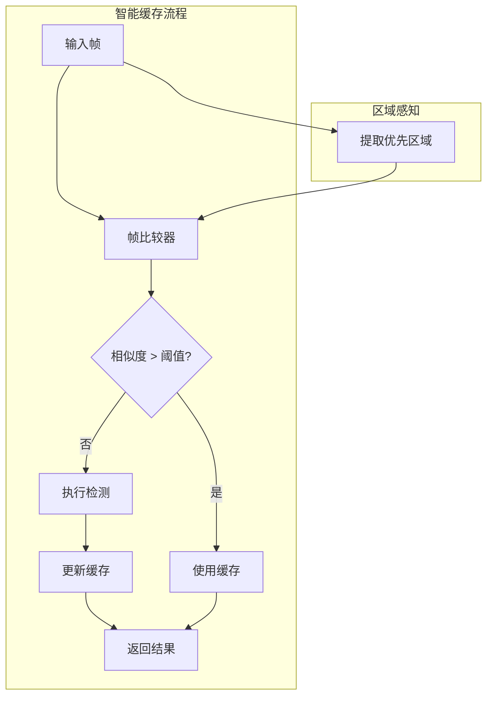

# 设计文档

## 概述

本设计文档描述检测结果缓存优化功能的技术实现方案。通过智能缓存策略，根据画面变化程度决定是否重新执行检测，减少不必要的计算开销。

## 架构



## 组件和接口

### 1. 智能缓存 (SmartCache)

```python
class 智能缓存:
    """智能检测结果缓存"""
    
    def __init__(self, 检测器: 'YOLO检测器',
                 相似度阈值: float = 0.95,
                 过期时间: float = 0.5):
        """
        初始化智能缓存
        
        参数:
            检测器: YOLO 检测器实例
            相似度阈值: 使用缓存的相似度阈值
            过期时间: 缓存过期时间（秒）
        """
        pass
    
    def 检测(self, 图像: np.ndarray) -> List['检测结果']:
        """
        智能检测（自动决定是否使用缓存）
        
        返回:
            检测结果列表
        """
        pass
    
    def 强制刷新(self, 图像: np.ndarray) -> List['检测结果']:
        """强制执行新检测"""
        pass
    
    def 获取统计(self) -> dict:
        """获取缓存统计信息"""
        pass
```

### 2. 帧比较器 (FrameComparator)

```python
class 帧比较器:
    """计算帧之间的相似度"""
    
    def __init__(self, 方法: str = "histogram"):
        """
        初始化比较器
        
        参数:
            方法: "histogram" 或 "ssim"
        """
        pass
    
    def 比较(self, 帧1: np.ndarray, 帧2: np.ndarray) -> float:
        """
        比较两帧的相似度
        
        返回:
            相似度分数 (0.0-1.0)
        """
        pass
    
    def 比较区域(self, 帧1: np.ndarray, 帧2: np.ndarray,
                 区域: tuple) -> float:
        """比较指定区域的相似度"""
        pass
```

### 3. 缓存策略 (CachePolicy)

```python
class 缓存策略:
    """可配置的缓存策略"""
    
    def __init__(self, 配置: dict = None):
        self.全局阈值 = 0.95
        self.过期时间 = 0.5
        self.优先区域 = []  # [(x, y, w, h, 阈值), ...]
    
    def 从配置加载(self, 配置路径: str):
        """从配置文件加载策略"""
        pass
    
    def 应该使用缓存(self, 相似度: float, 
                     区域相似度: List[float],
                     缓存年龄: float) -> bool:
        """
        判断是否应该使用缓存
        
        返回:
            是否使用缓存
        """
        pass
```

### 4. 缓存统计 (CacheStatistics)

```python
@dataclass
class 缓存统计:
    """缓存性能统计"""
    总请求数: int = 0
    缓存命中数: int = 0
    缓存未命中数: int = 0
    过期失效数: int = 0
    区域失效数: int = 0
    
    @property
    def 命中率(self) -> float:
        """计算缓存命中率"""
        pass
```

## 数据模型

### 缓存配置

```python
缓存配置 = {
    "全局相似度阈值": 0.95,
    "过期时间": 0.5,  # 秒
    "比较方法": "histogram",  # "histogram" 或 "ssim"
    "优先区域": [
        {
            "名称": "屏幕中心",
            "区域": [0.3, 0.3, 0.4, 0.4],  # 相对坐标
            "阈值": 0.9  # 更严格的阈值
        }
    ],
    "启用时间过期": True,
    "预热帧数": 1
}
```

### 缓存条目

```python
@dataclass
class 缓存条目:
    结果: List['检测结果']
    时间戳: float
    参考帧: np.ndarray  # 用于比较的参考帧
    帧哈希: str  # 快速比较用
```

## 正确性属性

### 属性 1: 相似度计算一致性

*对于任意* 两帧图像，相似度计算应满足：相同图像相似度为 1.0，完全不同图像相似度接近 0.0

**验证: 需求 1.1**

### 属性 2: 缓存过期正确性

*对于任意* 超过过期时间的缓存，下次请求应触发新检测

**验证: 需求 4.1, 4.2**

### 属性 3: 优先区域敏感性

*对于任意* 优先区域发生显著变化的帧，即使全局相似度高也应触发新检测

**验证: 需求 3.2**

## 错误处理

| 错误场景 | 处理策略 |
|---------|---------|
| 比较计算失败 | 触发新检测 |
| 缓存损坏 | 清空缓存，重新检测 |
| 配置无效 | 使用默认配置 |

## 测试策略

### 单元测试
- 测试相似度计算
- 测试缓存过期逻辑
- 测试区域比较

### 属性测试
- 属性 1: 生成相似/不同图像对，验证相似度
- 属性 2: 模拟时间流逝，验证过期行为
- 属性 3: 修改优先区域，验证缓存失效
