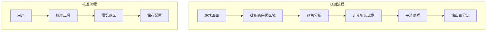

# 设计文档

## 概述

本设计文档描述血量/蓝量检测功能的技术实现方案。通过图像识别技术检测游戏界面中的血条和蓝条，获取角色当前的生命值和魔法值百分比。

## 架构



## 组件和接口

### 1. 血量检测器 (HealthDetector)

```python
class 血量检测器:
    """检测游戏血条的填充百分比"""
    
    def __init__(self, 配置: dict = None):
        """
        初始化血量检测器
        
        参数:
            配置: 检测配置字典
        """
        pass
    
    def 检测(self, 图像: np.ndarray) -> float:
        """
        检测血量百分比
        
        参数:
            图像: 游戏画面
            
        返回:
            血量百分比 (0.0-1.0)
        """
        pass
    
    def 获取置信度(self) -> float:
        """获取最近一次检测的置信度"""
        pass
    
    def 设置区域(self, 区域: tuple):
        """设置血条感兴趣区域 (x, y, width, height)"""
        pass
```

### 2. 蓝量检测器 (ManaDetector)

```python
class 蓝量检测器:
    """检测游戏蓝条的填充百分比"""
    
    def __init__(self, 配置: dict = None):
        pass
    
    def 检测(self, 图像: np.ndarray) -> float:
        """检测蓝量百分比"""
        pass
```

### 3. 状态条分析器 (StatusBarAnalyzer)

```python
class 状态条分析器:
    """分析状态条填充程度"""
    
    def __init__(self, 颜色范围: dict):
        """
        初始化分析器
        
        参数:
            颜色范围: HSV 颜色范围配置
        """
        pass
    
    def 分析(self, 区域图像: np.ndarray) -> tuple:
        """
        分析状态条
        
        返回:
            (填充百分比, 置信度)
        """
        pass
    
    def 检测填充边界(self, 区域图像: np.ndarray) -> int:
        """检测填充区域的右边界位置"""
        pass
```

### 4. 校准工具 (CalibrationTool)

```python
class 校准工具:
    """血条/蓝条区域校准工具"""
    
    def __init__(self):
        pass
    
    def 启动校准(self, 类型: str = "血条"):
        """
        启动校准流程
        
        参数:
            类型: "血条" 或 "蓝条"
        """
        pass
    
    def 预览区域(self, 图像: np.ndarray, 区域: tuple) -> np.ndarray:
        """预览选中区域"""
        pass
    
    def 保存配置(self, 配置路径: str):
        """保存校准配置"""
        pass
```

### 5. 平滑器 (Smoother)

```python
class 平滑器:
    """检测结果平滑处理"""
    
    def __init__(self, 窗口大小: int = 5, 突变阈值: float = 0.1):
        self._历史 = deque(maxlen=窗口大小)
        self._突变阈值 = 突变阈值
    
    def 平滑(self, 值: float) -> float:
        """
        平滑处理
        
        参数:
            值: 原始检测值
            
        返回:
            平滑后的值
        """
        pass
```

## 数据模型

### 检测配置

```python
检测配置 = {
    "血条": {
        "区域": [100, 50, 200, 20],  # x, y, width, height
        "颜色": {
            "满血": {"H": [0, 10], "S": [100, 255], "V": [100, 255]},  # 红色
            "低血": {"H": [0, 10], "S": [100, 255], "V": [50, 150]},   # 暗红
            "空血": {"H": [0, 180], "S": [0, 50], "V": [0, 100]}       # 灰色
        },
        "方向": "horizontal",  # 填充方向
        "平滑窗口": 5
    },
    "蓝条": {
        "区域": [100, 75, 200, 15],
        "颜色": {
            "满蓝": {"H": [100, 130], "S": [100, 255], "V": [100, 255]},
            "空蓝": {"H": [0, 180], "S": [0, 50], "V": [0, 100]}
        },
        "方向": "horizontal",
        "平滑窗口": 5
    }
}
```

### 检测结果

```python
@dataclass
class 状态检测结果:
    血量百分比: float
    蓝量百分比: float
    血量置信度: float
    蓝量置信度: float
    检测时间: float
```

## 正确性属性

### 属性 1: 检测值范围

*对于任意* 检测结果，血量和蓝量百分比应在 [0.0, 1.0] 范围内

**验证: 需求 2.5, 3.3**

### 属性 2: 平滑稳定性

*对于任意* 连续相似的输入，平滑后的输出变化应小于突变阈值

**验证: 需求 4.1, 4.2**

### 属性 3: 突变响应性

*对于任意* 血量显著变化（>10%），检测器应在下一帧立即反映

**验证: 需求 4.3**

## 错误处理

| 错误场景 | 处理策略 |
|---------|---------|
| 区域未配置 | 返回 1.0（满血/满蓝） |
| 检测失败 | 返回上次有效值 |
| 连续失败超时 | 返回 1.0 并记录警告 |
| 图像无效 | 返回上次有效值 |

## 测试策略

### 单元测试
- 测试颜色分析
- 测试填充计算
- 测试平滑处理

### 属性测试
- 属性 1: 生成随机图像，验证输出范围
- 属性 2: 生成相似帧序列，验证平滑效果
- 属性 3: 模拟血量突变，验证响应速度
