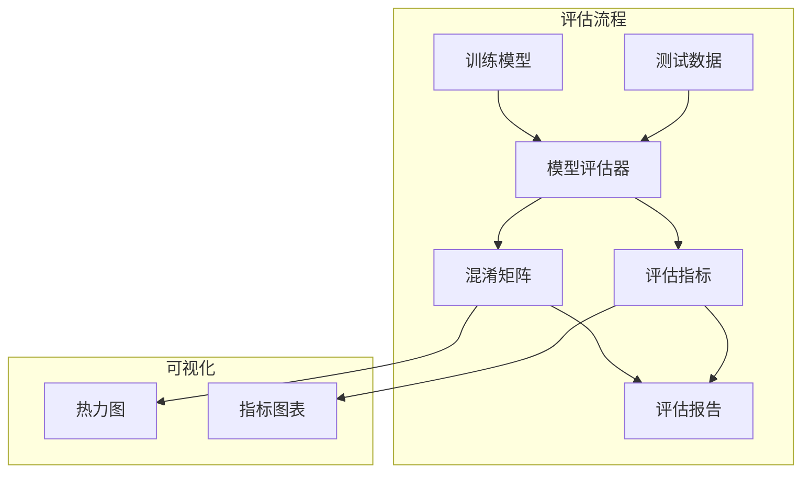

# 设计文档

## 概述

本设计文档描述模型评估工具的技术实现方案。提供混淆矩阵、准确率、召回率等评估指标，帮助分析模型在不同动作类别上的表现。

## 架构



## 组件和接口

### 1. 模型评估器 (ModelEvaluator)

```python
class 模型评估器:
    """模型性能评估器"""
    
    def __init__(self, 模型, 动作定义: dict):
        """
        初始化评估器
        
        参数:
            模型: 待评估的模型
            动作定义: 动作索引到名称的映射
        """
        pass
    
    def 评估(self, 测试数据: List[tuple]) -> '评估结果':
        """
        在测试数据上评估模型
        
        参数:
            测试数据: [(图像, 标签), ...] 列表
            
        返回:
            评估结果对象
        """
        pass
    
    def 生成混淆矩阵(self, 预测: List[int], 真实: List[int]) -> np.ndarray:
        """生成混淆矩阵"""
        pass
    
    def 计算指标(self, 混淆矩阵: np.ndarray) -> dict:
        """计算各项评估指标"""
        pass
```

### 2. 评估结果 (EvaluationResult)

```python
@dataclass
class 评估结果:
    """评估结果数据类"""
    总体准确率: float
    类别指标: Dict[str, dict]  # {类别名: {精确率, 召回率, F1}}
    混淆矩阵: np.ndarray
    宏平均: dict
    加权平均: dict
    评估时间: float
    样本数量: int
```

### 3. 报告生成器 (ReportGenerator)

```python
class 报告生成器:
    """评估报告生成器"""
    
    def __init__(self, 评估结果: 评估结果, 动作定义: dict):
        pass
    
    def 生成文本报告(self) -> str:
        """生成文本格式报告"""
        pass
    
    def 生成Markdown报告(self, 输出路径: str):
        """生成 Markdown 格式报告"""
        pass
    
    def 生成HTML报告(self, 输出路径: str):
        """生成 HTML 格式报告"""
        pass
```

### 4. 可视化器 (Visualizer)

```python
class 可视化器:
    """评估结果可视化"""
    
    def 绘制混淆矩阵(self, 混淆矩阵: np.ndarray, 
                     类别名称: List[str],
                     保存路径: str = None):
        """绘制混淆矩阵热力图"""
        pass
    
    def 绘制类别指标(self, 类别指标: dict, 保存路径: str = None):
        """绘制各类别指标柱状图"""
        pass
    
    def 高亮混淆对(self, 混淆矩阵: np.ndarray, 
                   阈值: float = 0.1) -> List[tuple]:
        """识别最容易混淆的动作对"""
        pass
```

## 数据模型

### 类别指标

```python
类别指标 = {
    "前进": {
        "精确率": 0.92,
        "召回率": 0.88,
        "F1分数": 0.90,
        "支持数": 150  # 样本数
    },
    "技能1": {
        "精确率": 0.75,
        "召回率": 0.82,
        "F1分数": 0.78,
        "支持数": 80
    },
    # ...
}
```

### 动作分组

```python
动作分组 = {
    "移动": [0, 1, 2, 3, 4, 5, 6, 7, 8],
    "技能": [9, 10, 11, 12, 13, 14, 15, 16, 17, 18],
    "特殊": [19, 20, 21],
    "鼠标": [22, 23, 24],
    "组合": [25, 26, 27, 28, 29, 30, 31]
}
```

## 正确性属性

### 属性 1: 指标计算正确性

*对于任意* 混淆矩阵，计算的精确率、召回率和 F1 分数应满足数学定义

**验证: 需求 1.1, 1.2, 1.3, 1.4**

### 属性 2: 混淆矩阵对称性

*对于任意* 预测结果，混淆矩阵的行和应等于各类别的实际样本数

**验证: 需求 2.1**

### 属性 3: 报告完整性

*对于任意* 评估结果，生成的报告应包含所有指标和混淆矩阵

**验证: 需求 3.2**

## 错误处理

| 错误场景 | 处理策略 |
|---------|---------|
| 测试数据为空 | 返回空结果并警告 |
| 类别样本数为 0 | 该类别指标标记为 N/A |
| 可视化失败 | 保存数据到文件，跳过图表 |

## 测试策略

### 单元测试
- 测试指标计算公式
- 测试混淆矩阵生成
- 测试报告格式

### 属性测试
- 属性 1: 生成随机预测，验证指标计算
- 属性 2: 验证混淆矩阵行和
- 属性 3: 验证报告包含所有必需字段
