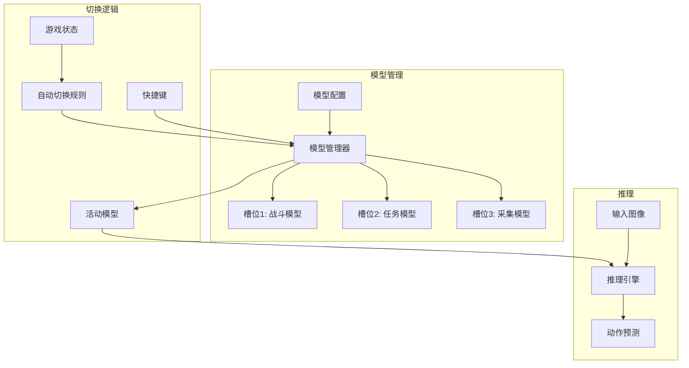

# 设计文档

## 概述

本设计文档描述模型热切换功能的技术实现方案。支持在运行时切换不同的 AI 模型，无需重启程序，实现动态适应不同游戏场景。

## 架构



## 组件和接口

### 1. 模型管理器 (ModelManager)

```python
class 模型管理器:
    """管理多个模型的加载和切换"""
    
    def __init__(self, 配置路径: str = None):
        """
        初始化模型管理器
        
        参数:
            配置路径: 模型配置文件路径
        """
        pass
    
    def 加载模型(self, 名称: str, 路径: str) -> bool:
        """
        加载模型到指定槽位
        
        返回:
            是否加载成功
        """
        pass
    
    def 卸载模型(self, 名称: str) -> bool:
        """卸载指定模型"""
        pass
    
    def 切换模型(self, 名称: str) -> bool:
        """
        切换活动模型
        
        返回:
            是否切换成功
        """
        pass
    
    def 获取活动模型(self) -> str:
        """获取当前活动模型名称"""
        pass
    
    def 预测(self, 图像: np.ndarray) -> List[float]:
        """使用活动模型进行预测"""
        pass
    
    def 获取内存使用(self) -> dict:
        """获取各模型内存使用情况"""
        pass
```

### 2. 模型槽位 (ModelSlot)

```python
@dataclass
class 模型槽位:
    """模型槽位信息"""
    名称: str
    路径: str
    模型实例: Any = None
    已加载: bool = False
    内存占用: int = 0  # 字节
    加载时间: float = 0.0
```

### 3. 自动切换规则 (AutoSwitchRule)

```python
@dataclass
class 自动切换规则:
    """自动切换规则"""
    名称: str
    触发状态: List[str]  # 触发切换的游戏状态
    目标模型: str
    优先级: int = 0
    冷却时间: float = 5.0  # 秒

class 自动切换器:
    """根据游戏状态自动切换模型"""
    
    def __init__(self, 模型管理器: 模型管理器):
        self._规则列表: List[自动切换规则] = []
        self._上次切换时间: float = 0.0
    
    def 添加规则(self, 规则: 自动切换规则):
        """添加自动切换规则"""
        pass
    
    def 检查切换(self, 当前状态: str) -> str:
        """
        检查是否需要切换
        
        返回:
            目标模型名称，None 表示不切换
        """
        pass
```

### 4. 快捷键处理器 (HotkeyHandler)

```python
class 快捷键处理器:
    """处理模型切换快捷键"""
    
    def __init__(self, 模型管理器: 模型管理器):
        self._快捷键映射: Dict[str, str] = {}  # 按键 -> 模型名
    
    def 注册快捷键(self, 按键: str, 模型名: str):
        """注册快捷键"""
        pass
    
    def 处理按键(self, 按键: str) -> bool:
        """
        处理按键事件
        
        返回:
            是否触发了模型切换
        """
        pass
    
    def 循环切换(self) -> str:
        """循环切换到下一个模型"""
        pass
```

## 数据模型

### 模型配置文件

```yaml
# models.yaml
模型列表:
  - 名称: "战斗模型"
    路径: "模型/战斗AI"
    描述: "优化战斗技能释放"
    适用状态: ["战斗"]
    快捷键: "F1"
    
  - 名称: "任务模型"
    路径: "模型/任务AI"
    描述: "优化主线任务"
    适用状态: ["移动", "对话", "拾取"]
    快捷键: "F2"
    
  - 名称: "采集模型"
    路径: "模型/采集AI"
    描述: "优化资源采集"
    适用状态: ["采集"]
    快捷键: "F3"

自动切换:
  启用: true
  冷却时间: 5.0

默认模型: "任务模型"
```

### 切换事件

```python
@dataclass
class 切换事件:
    时间戳: float
    原模型: str
    新模型: str
    触发方式: str  # "manual", "auto", "hotkey"
    触发原因: str
```

## 正确性属性

### 属性 1: 切换原子性

*对于任意* 模型切换操作，切换过程中不应返回无效预测结果

**验证: 需求 2.1, 2.3**

### 属性 2: 切换速度

*对于任意* 模型切换请求，切换完成时间应小于 100ms

**验证: 需求 2.2**

### 属性 3: 冷却时间有效性

*对于任意* 自动切换，两次切换之间的间隔应不小于配置的冷却时间

**验证: 需求 3.3**

## 错误处理

| 错误场景 | 处理策略 |
|---------|---------|
| 模型文件不存在 | 跳过加载，记录错误 |
| 内存不足 | 卸载最少使用的模型 |
| 切换失败 | 保持当前模型，记录错误 |
| 配置无效 | 使用默认配置 |

## 测试策略

### 单元测试
- 测试模型加载卸载
- 测试切换逻辑
- 测试快捷键处理

### 属性测试
- 属性 1: 并发切换测试
- 属性 2: 测量切换耗时
- 属性 3: 验证冷却时间
