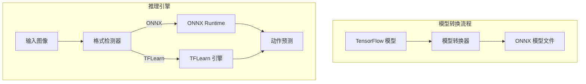

# 设计文档

## 概述

本设计文档描述模型推理加速功能的技术实现方案。通过将 TFLearn/TensorFlow 模型转换为 ONNX 格式，并使用 ONNX Runtime 进行推理，实现 2-5 倍的推理速度提升。

## 架构



## 组件和接口

### 1. 模型转换器 (ModelConverter)

```python
class 模型转换器:
    """将 TensorFlow 模型转换为 ONNX 格式"""
    
    def __init__(self, 输入形状: tuple = (1, 480, 270, 3)):
        """
        初始化转换器
        
        参数:
            输入形状: 模型输入张量形状 (batch, width, height, channels)
        """
        pass
    
    def 转换(self, tf模型路径: str, onnx输出路径: str) -> bool:
        """
        执行模型转换
        
        参数:
            tf模型路径: TensorFlow 模型文件路径
            onnx输出路径: ONNX 模型输出路径
            
        返回:
            转换是否成功
        """
        pass
    
    def 验证(self, onnx模型路径: str) -> dict:
        """
        验证转换后的模型
        
        返回:
            验证结果字典，包含输入输出信息
        """
        pass
```

### 2. ONNX 推理引擎 (ONNXInferenceEngine)

```python
class ONNX推理引擎:
    """使用 ONNX Runtime 进行模型推理"""
    
    def __init__(self, 模型路径: str, 使用GPU: bool = True):
        """
        初始化推理引擎
        
        参数:
            模型路径: ONNX 模型文件路径
            使用GPU: 是否使用 GPU 加速
        """
        pass
    
    def 预测(self, 图像: np.ndarray) -> List[float]:
        """
        执行推理预测
        
        参数:
            图像: 输入图像 (width, height, 3)
            
        返回:
            动作概率列表
        """
        pass
    
    def 获取延迟统计(self) -> dict:
        """获取推理延迟统计信息"""
        pass
```

### 3. 统一推理接口 (UnifiedInferenceEngine)

```python
class 统一推理引擎:
    """统一的推理接口，自动选择后端"""
    
    def __init__(self, 模型路径: str, 首选后端: str = "auto"):
        """
        初始化统一推理引擎
        
        参数:
            模型路径: 模型文件路径
            首选后端: "auto", "onnx", "tflearn"
        """
        pass
    
    def 预测(self, 图像: np.ndarray) -> List[float]:
        """执行推理预测"""
        pass
    
    def 获取当前后端(self) -> str:
        """获取当前使用的推理后端"""
        pass
```

## 数据模型

### 推理配置

```python
@dataclass
class 推理配置:
    模型路径: str
    后端类型: str  # "onnx" 或 "tflearn"
    使用GPU: bool = True
    输入宽度: int = 480
    输入高度: int = 270
    预热次数: int = 10  # 预热推理次数
```

### 性能指标

```python
@dataclass
class 性能指标:
    平均延迟: float  # 毫秒
    最小延迟: float
    最大延迟: float
    推理次数: int
    后端类型: str
```

## 正确性属性

*正确性属性是在所有有效执行中都应保持为真的特征或行为，本质上是关于系统应该做什么的正式陈述。*

### 属性 1: 模型转换保持输出一致性

*对于任意* 有效输入图像，ONNX 模型的输出应与原始 TFLearn 模型的输出在误差范围内一致（差异 < 0.01）

**验证: 需求 1.2, 1.4**

### 属性 2: 推理延迟满足要求

*对于任意* 推理请求，ONNX Runtime 的推理延迟应小于 50ms

**验证: 需求 2.2**

### 属性 3: 后端自动检测正确性

*对于任意* 模型文件，统一推理引擎应正确识别模型格式并选择对应后端

**验证: 需求 4.1, 4.2, 4.3**

## 错误处理

| 错误场景 | 处理策略 |
|---------|---------|
| ONNX Runtime 不可用 | 回退到 TFLearn 后端 |
| GPU 不可用 | 回退到 CPU 推理 |
| 模型文件损坏 | 返回错误信息，建议重新转换 |
| 转换失败 | 记录详细错误，保留原模型 |

## 测试策略

### 单元测试
- 测试模型转换功能
- 测试 ONNX 推理引擎初始化
- 测试后端自动检测

### 属性测试
- 属性 1: 生成随机图像，比较两个后端的输出差异
- 属性 2: 多次推理，验证延迟分布
- 属性 3: 测试不同格式模型文件的检测
