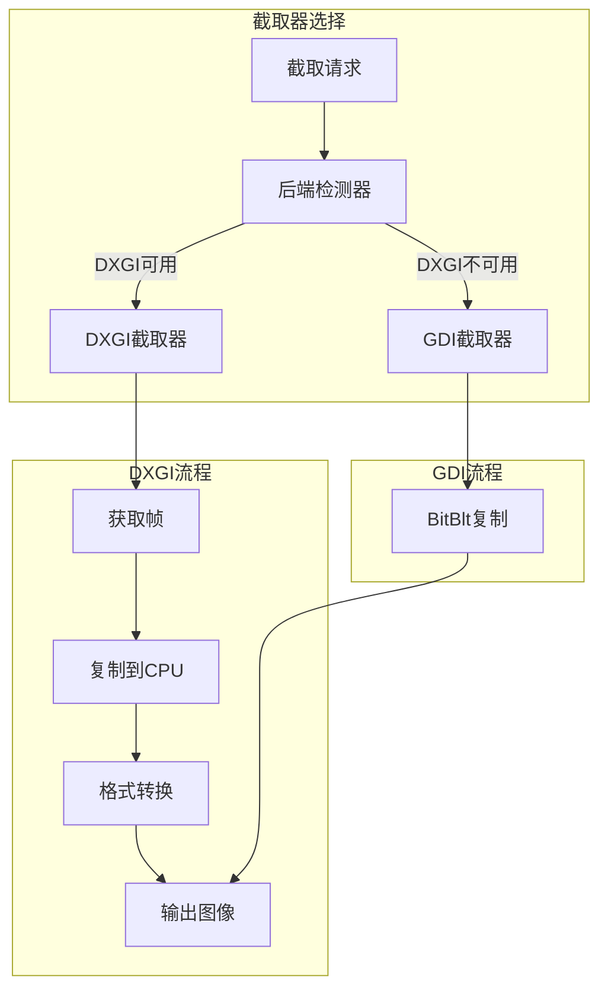

# 设计文档

## 概述

本设计文档描述屏幕截取优化功能的技术实现方案。通过使用 DXGI Desktop Duplication API 替代传统 GDI 截图，提升截图速度和效率。

## 架构



## 组件和接口

### 1. 屏幕截取器 (ScreenCapturer)

```python
class 屏幕截取器:
    """统一的屏幕截取接口"""
    
    def __init__(self, 首选后端: str = "auto"):
        """
        初始化截取器
        
        参数:
            首选后端: "auto", "dxgi", "gdi"
        """
        pass
    
    def 截取(self, 区域: tuple = None) -> np.ndarray:
        """
        截取屏幕
        
        参数:
            区域: (左, 上, 右, 下) 或 None 表示全屏
            
        返回:
            RGB 格式的 numpy 数组
        """
        pass
    
    def 截取并缩放(self, 区域: tuple = None, 
                   目标尺寸: tuple = (480, 270)) -> np.ndarray:
        """截取并缩放到指定尺寸"""
        pass
    
    def 获取当前后端(self) -> str:
        """获取当前使用的截取后端"""
        pass
    
    def 获取性能统计(self) -> dict:
        """获取截取性能统计"""
        pass
```

### 2. DXGI 截取器 (DXGICapturer)

```python
class DXGI截取器:
    """基于 DXGI Desktop Duplication 的截取器"""
    
    def __init__(self, 显示器索引: int = 0):
        """
        初始化 DXGI 截取器
        
        参数:
            显示器索引: 要截取的显示器索引
        """
        pass
    
    def 初始化(self) -> bool:
        """初始化 DXGI 资源"""
        pass
    
    def 截取(self, 区域: tuple = None) -> np.ndarray:
        """执行截取"""
        pass
    
    def 释放(self):
        """释放 DXGI 资源"""
        pass
    
    def 重新初始化(self) -> bool:
        """重新初始化（用于错误恢复）"""
        pass
```

### 3. GDI 截取器 (GDICapturer)

```python
class GDI截取器:
    """基于 GDI 的传统截取器"""
    
    def 截取(self, 区域: tuple = None) -> np.ndarray:
        """执行截取"""
        pass
```

### 4. 后端检测器 (BackendDetector)

```python
class 后端检测器:
    """检测可用的截取后端"""
    
    @staticmethod
    def DXGI可用() -> bool:
        """检测 DXGI 是否可用"""
        pass
    
    @staticmethod
    def 获取最佳后端() -> str:
        """获取当前系统的最佳后端"""
        pass
    
    @staticmethod
    def 获取系统信息() -> dict:
        """获取系统图形信息"""
        pass
```

## 数据模型

### 截取配置

```python
截取配置 = {
    "首选后端": "auto",  # "auto", "dxgi", "gdi"
    "显示器索引": 0,
    "帧缓冲区数量": 2,  # DXGI 双缓冲
    "超时时间": 100,  # 毫秒
    "自动恢复": True,
    "性能监控": True
}
```

### 性能统计

```python
@dataclass
class 截取性能统计:
    后端类型: str
    平均截取时间: float  # 毫秒
    最小截取时间: float
    最大截取时间: float
    截取次数: int
    失败次数: int
    恢复次数: int
```

## 正确性属性

### 属性 1: 输出格式一致性

*对于任意* 截取请求，DXGI 和 GDI 后端应返回相同格式的图像（numpy 数组，RGB）

**验证: 需求 1.3, 5.3**

### 属性 2: 区域截取准确性

*对于任意* 指定区域，截取结果的尺寸应与区域大小一致

**验证: 需求 1.4, 5.2**

### 属性 3: 错误恢复能力

*对于任意* DXGI 截取失败，系统应能自动恢复或回退到 GDI

**验证: 需求 4.1, 4.2**

## 错误处理

| 错误场景 | 处理策略 |
|---------|---------|
| DXGI 初始化失败 | 回退到 GDI |
| 帧获取超时 | 重试一次，失败则返回上一帧 |
| 显示模式变化 | 重新初始化 DXGI |
| 资源泄漏 | 定期检查并释放 |

## 测试策略

### 单元测试
- 测试后端检测
- 测试区域截取
- 测试格式转换

### 属性测试
- 属性 1: 比较两个后端的输出格式
- 属性 2: 随机区域截取，验证尺寸
- 属性 3: 模拟错误，验证恢复
