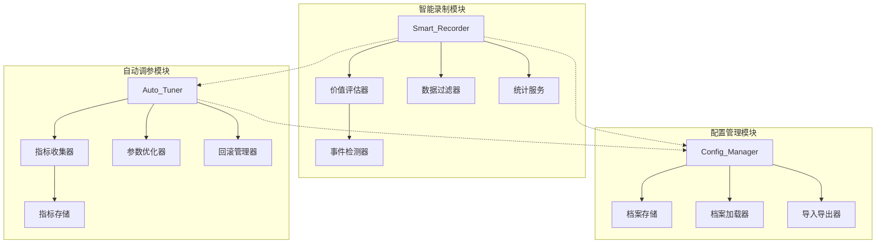

# 设计文档

## 概述

本设计文档描述智能训练系统的三个核心模块：智能录制器(Smart_Recorder)、配置管理器(Config_Manager)和自动调参器(Auto_Tuner)。系统采用模块化设计，各模块独立运行但共享数据接口。

## 架构



## 组件和接口

### 智能录制器 (Smart_Recorder)

```python
class RecordingSegment:
    """录制片段数据结构"""
    id: str                    # 片段唯一标识
    start_time: float          # 开始时间戳
    end_time: float            # 结束时间戳
    frames: List[np.ndarray]   # 画面帧列表
    actions: List[int]         # 动作序列
    events: List[GameEvent]    # 检测到的游戏事件
    value_score: float         # 价值评分 (0-100)
    value_level: str           # 价值等级: "high", "medium", "low"
    tags: List[str]            # 标签: "kill", "quest", "pickup", "combo", "idle", "repeat", "stuck"

class GameEvent:
    """游戏事件数据结构"""
    event_type: str            # 事件类型
    timestamp: float           # 发生时间
    confidence: float          # 置信度
    data: Dict[str, Any]       # 附加数据

class ValueEvaluator:
    """价值评估器接口"""
    def evaluate_segment(self, segment: RecordingSegment) -> float:
        """评估片段价值，返回0-100分"""
        pass
    
    def classify_event(self, event: GameEvent) -> Tuple[str, float]:
        """分类事件并返回价值等级和分数增量"""
        pass

class DataFilter:
    """数据过滤器接口"""
    def is_idle(self, actions: List[int], duration: float) -> bool:
        """检测是否为空闲状态（连续无操作）"""
        pass
    
    def is_repetitive(self, actions: List[int], threshold: int = 10) -> bool:
        """检测是否为重复操作"""
        pass
    
    def is_stuck(self, frames: List[np.ndarray], duration: float) -> bool:
        """检测角色是否卡住"""
        pass
    
    def is_loading(self, frame: np.ndarray) -> bool:
        """检测是否为加载画面"""
        pass

class RecordingStatistics:
    """录制统计数据结构"""
    total_segments: int
    high_value_count: int
    medium_value_count: int
    low_value_count: int
    action_distribution: Dict[int, int]  # 动作ID -> 样本数量
    total_duration: float
    average_value_score: float
```

### 配置管理器 (Config_Manager)

```python
class GameProfile:
    """游戏配置档案数据结构"""
    name: str                           # 档案名称
    game_name: str                      # 游戏名称
    created_at: datetime                # 创建时间
    updated_at: datetime                # 更新时间
    
    # 窗口配置
    window_config: WindowConfig
    # 按键映射
    key_mapping: KeyMapping
    # UI区域配置
    ui_regions: UIRegions
    # 检测参数
    detection_params: DetectionParams
    # 决策规则
    decision_rules: DecisionRules

class WindowConfig:
    """窗口配置"""
    x: int
    y: int
    width: int
    height: int
    
class KeyMapping:
    """按键映射配置"""
    move_keys: Dict[str, str]      # 移动键映射
    skill_keys: Dict[str, str]     # 技能键映射
    interact_key: str              # 交互键
    
class UIRegions:
    """UI区域配置"""
    health_bar: Tuple[int, int, int, int]    # 血条区域
    skill_bar: Tuple[int, int, int, int]     # 技能栏区域
    dialog_area: Tuple[int, int, int, int]   # 对话框区域
    minimap: Tuple[int, int, int, int]       # 小地图区域

class ConfigManager:
    """配置管理器接口"""
    def create_profile(self, name: str, game_name: str) -> GameProfile:
        """创建新配置档案"""
        pass
    
    def save_profile(self, profile: GameProfile) -> bool:
        """保存配置档案"""
        pass
    
    def load_profile(self, name: str) -> GameProfile:
        """加载配置档案"""
        pass
    
    def delete_profile(self, name: str) -> bool:
        """删除配置档案"""
        pass
    
    def list_profiles(self) -> List[str]:
        """列出所有档案名称"""
        pass
    
    def export_profile(self, name: str, filepath: str) -> bool:
        """导出档案为JSON文件"""
        pass
    
    def import_profile(self, filepath: str) -> GameProfile:
        """从JSON文件导入档案"""
        pass
    
    def switch_profile(self, name: str) -> bool:
        """切换当前使用的档案"""
        pass
    
    def get_current_profile(self) -> GameProfile:
        """获取当前档案"""
        pass
    
    def has_unsaved_changes(self) -> bool:
        """检查是否有未保存的更改"""
        pass
```

### 自动调参器 (Auto_Tuner)

```python
class PerformanceMetric:
    """性能指标数据结构"""
    timestamp: datetime
    action_success_rate: float      # 动作执行成功率
    state_accuracy: float           # 状态识别准确率
    stuck_count: int                # 卡住次数
    task_efficiency: float          # 任务完成效率
    
class ParameterSpace:
    """参数空间定义"""
    name: str
    min_value: float
    max_value: float
    step: float
    current_value: float
    default_value: float
    locked: bool                    # 是否锁定

class TuningRecord:
    """调参记录"""
    timestamp: datetime
    parameter_name: str
    old_value: float
    new_value: float
    reason: str
    performance_before: PerformanceMetric
    performance_after: Optional[PerformanceMetric]
    
class AggressivenessLevel(Enum):
    """调参激进程度"""
    CONSERVATIVE = "conservative"   # 保守：每次调整1个步长
    BALANCED = "balanced"           # 平衡：每次调整2个步长
    AGGRESSIVE = "aggressive"       # 激进：每次调整3个步长

class AutoTuner:
    """自动调参器接口"""
    def __init__(self, enabled: bool = False, aggressiveness: AggressivenessLevel = AggressivenessLevel.BALANCED):
        pass
    
    def collect_metric(self, metric: PerformanceMetric) -> None:
        """收集性能指标"""
        pass
    
    def get_aggregated_metrics(self, window_minutes: int = 5) -> PerformanceMetric:
        """获取时间窗口内的汇总指标"""
        pass
    
    def should_tune(self) -> bool:
        """判断是否应该进行调参"""
        pass
    
    def tune_parameter(self, param_name: str) -> TuningRecord:
        """调整指定参数"""
        pass
    
    def rollback(self, record: TuningRecord) -> bool:
        """回滚参数调整"""
        pass
    
    def lock_parameter(self, param_name: str) -> None:
        """锁定参数"""
        pass
    
    def unlock_parameter(self, param_name: str) -> None:
        """解锁参数"""
        pass
    
    def reset_to_defaults(self) -> None:
        """重置所有参数为默认值"""
        pass
    
    def get_parameter_diff(self) -> Dict[str, Tuple[float, float]]:
        """获取当前参数与默认值的差异"""
        pass
    
    def is_performance_degraded(self, current: PerformanceMetric, baseline: PerformanceMetric) -> bool:
        """判断性能是否下降"""
        pass
```

## 数据模型

### 存储结构

```
配置/
├── profiles/                    # 游戏配置档案目录
│   ├── default.json            # 默认配置
│   ├── game1.json              # 游戏1配置
│   └── game2.json              # 游戏2配置
├── last_profile.txt            # 上次使用的档案名
└── tuning/                     # 调参数据目录
    ├── metrics.json            # 性能指标历史
    ├── records.json            # 调参记录
    └── parameters.json         # 当前参数值
```

### JSON Schema

```json
{
  "GameProfile": {
    "name": "string",
    "game_name": "string",
    "created_at": "datetime",
    "updated_at": "datetime",
    "window_config": {
      "x": "int",
      "y": "int", 
      "width": "int",
      "height": "int"
    },
    "key_mapping": {
      "move_keys": {"W": "up", "S": "down", "A": "left", "D": "right"},
      "skill_keys": {"1": "skill1", "2": "skill2"},
      "interact_key": "F"
    },
    "ui_regions": {
      "health_bar": [x, y, w, h],
      "skill_bar": [x, y, w, h],
      "dialog_area": [x, y, w, h],
      "minimap": [x, y, w, h]
    },
    "detection_params": {
      "yolo_model_path": "string",
      "confidence_threshold": "float"
    },
    "decision_rules": {
      "state_priorities": {"combat": 1, "dialog": 2},
      "action_weights": {"skill": 1.0, "move": 0.8}
    }
  }
}
```

## 正确性属性

*正确性属性是系统应该在所有有效执行中保持为真的特征或行为。属性作为人类可读规范和机器可验证正确性保证之间的桥梁。*

### Property 1: 价值评分范围约束
*对于任意* RecordingSegment，其 value_score 必须在 0 到 100 之间（包含边界）。
**验证: 需求 1.6**

### Property 2: 事件类型与价值等级映射一致性
*对于任意* GameEvent，如果事件类型为击杀(kill)、任务完成(quest_complete)或技能连招(combo)，则对应片段的 value_level 必须为 "high"；如果事件类型为拾取(pickup)，则 value_level 必须为 "medium"。
**验证: 需求 1.2, 1.3, 1.4, 1.5**

### Property 3: 空闲检测正确性
*对于任意* 动作序列，如果连续无操作时间超过5秒，则 is_idle() 必须返回 True。
**验证: 需求 2.1**

### Property 4: 重复操作检测正确性
*对于任意* 动作序列，如果相同动作连续出现超过10次，则 is_repetitive() 必须返回 True。
**验证: 需求 2.2**

### Property 5: 统计计算一致性
*对于任意* 录制会话的片段集合，high_value_count + medium_value_count + low_value_count 必须等于 total_segments。
**验证: 需求 3.2**

### Property 6: 配置档案CRUD一致性
*对于任意* GameProfile，创建后必须能通过 load_profile 加载到相同数据；删除后 load_profile 必须失败或返回空。
**验证: 需求 4.1, 4.2, 4.3, 4.6**

### Property 7: 配置导入导出Round-Trip
*对于任意* 有效的 GameProfile，export_profile 后再 import_profile 必须得到等价的配置数据。
**验证: 需求 4.4, 4.5**

### Property 8: 配置档案完整性
*对于任意* GameProfile，必须包含所有必要字段：window_config、key_mapping、ui_regions、detection_params、decision_rules。
**验证: 需求 5.1, 5.2, 5.3, 5.4, 5.5**

### Property 9: 配置切换即时生效
*对于任意* 配置切换操作，switch_profile 成功后 get_current_profile 必须返回新切换的档案。
**验证: 需求 6.2**

### Property 10: 上次配置持久化
*对于任意* 配置切换操作，切换后的档案名必须被持久化，重新初始化 ConfigManager 后必须自动加载该档案。
**验证: 需求 6.4**

### Property 11: 性能指标汇总正确性
*对于任意* 时间窗口内的性能指标集合，汇总后的各项指标必须是该窗口内所有指标的正确聚合（平均值或累加值）。
**验证: 需求 7.2**

### Property 12: 性能数据持久化Round-Trip
*对于任意* PerformanceMetric，存储后再读取必须得到等价的数据。
**验证: 需求 7.4**

### Property 13: 参数调整范围约束
*对于任意* 参数调整操作，调整后的参数值必须在 ParameterSpace 定义的 [min_value, max_value] 范围内。
**验证: 需求 8.1, 8.3**

### Property 14: 参数保留/回滚决策正确性
*对于任意* 参数调整，如果调整后性能提升（is_performance_degraded 返回 False），则参数保留；如果性能下降，则参数回滚到调整前的值。
**验证: 需求 8.4, 8.5**

### Property 15: 渐进式调整约束
*对于任意* 参数调整，单次调整幅度不超过 aggressiveness 级别对应的步长倍数（保守=1x，平衡=2x，激进=3x）。
**验证: 需求 8.6, 9.2**

### Property 16: 参数锁定有效性
*对于任意* 被锁定的参数，自动调参过程中该参数值必须保持不变。
**验证: 需求 9.3**

### Property 17: 默认值恢复正确性
*对于任意* 参数，调用 reset_to_defaults 后，该参数的 current_value 必须等于 default_value。
**验证: 需求 9.5**

### Property 18: 参数差异计算正确性
*对于任意* 参数，get_parameter_diff 返回的差异值必须等于 current_value - default_value。
**验证: 需求 9.6**

## 错误处理

### 智能录制模块
- 画面捕获失败：记录警告日志，跳过当前帧继续录制
- 事件检测超时：使用默认低价值评分，不阻塞录制流程
- 存储空间不足：提前警告用户，自动保存当前数据

### 配置管理模块
- 配置文件损坏：加载默认配置，提示用户
- 导入文件格式错误：返回详细错误信息，不覆盖现有配置
- 档案名冲突：提示用户选择覆盖或重命名

### 自动调参模块
- 性能指标收集失败：使用上一次有效指标，记录警告
- 参数调整失败：保持原参数值，记录错误日志
- 存储写入失败：内存中保留数据，定期重试写入

## 测试策略

### 单元测试
- 测试各组件的独立功能
- 测试边界条件和异常输入
- 测试错误处理逻辑

### 属性测试
- 使用 Hypothesis 库进行属性测试
- 每个属性测试运行至少100次迭代
- 测试标签格式: **Feature: smart-training-system, Property {number}: {property_text}**

### 集成测试
- 测试模块间的数据流
- 测试配置切换对其他模块的影响
- 测试错误降级机制

