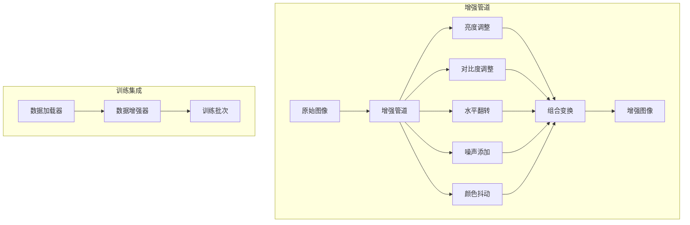

# 设计文档

## 概述

本设计文档描述训练数据增强功能的技术实现方案。通过图像变换技术扩充训练数据集，提高模型的泛化能力。

## 架构



## 组件和接口

### 1. 数据增强器 (DataAugmentor)

```python
class 数据增强器:
    """训练数据增强器"""
    
    def __init__(self, 配置: dict = None):
        """
        初始化数据增强器
        
        参数:
            配置: 增强配置字典
        """
        pass
    
    def 增强(self, 图像: np.ndarray) -> np.ndarray:
        """
        对单张图像应用增强
        
        参数:
            图像: 输入图像 (H, W, C)
            
        返回:
            增强后的图像
        """
        pass
    
    def 批量增强(self, 图像列表: List[np.ndarray]) -> List[np.ndarray]:
        """对批量图像应用增强"""
        pass
    
    def 预览(self, 图像: np.ndarray, 数量: int = 5) -> List[np.ndarray]:
        """生成多个增强预览"""
        pass
```

### 2. 变换操作 (Transform)

```python
class 变换基类:
    """变换操作基类"""
    
    def __init__(self, 概率: float = 0.5, 强度: float = 1.0):
        self.概率 = 概率
        self.强度 = 强度
    
    def __call__(self, 图像: np.ndarray) -> np.ndarray:
        """应用变换"""
        pass

class 亮度调整(变换基类):
    """调整图像亮度"""
    def __init__(self, 范围: tuple = (-0.2, 0.2), **kwargs):
        super().__init__(**kwargs)
        self.范围 = 范围

class 对比度调整(变换基类):
    """调整图像对比度"""
    pass

class 水平翻转(变换基类):
    """水平翻转图像"""
    pass

class 高斯噪声(变换基类):
    """添加高斯噪声"""
    pass

class 颜色抖动(变换基类):
    """颜色抖动（色调、饱和度）"""
    pass
```

### 3. 增强管道 (AugmentationPipeline)

```python
class 增强管道:
    """可配置的增强管道"""
    
    def __init__(self):
        self.变换列表: List[变换基类] = []
    
    def 添加变换(self, 变换: 变换基类) -> '增强管道':
        """添加变换操作"""
        pass
    
    def 从配置加载(self, 配置: dict) -> '增强管道':
        """从配置字典加载管道"""
        pass
    
    def 保存配置(self, 路径: str):
        """保存管道配置"""
        pass
    
    def __call__(self, 图像: np.ndarray) -> np.ndarray:
        """执行管道"""
        pass
```

## 数据模型

### 增强配置

```python
增强配置 = {
    "亮度调整": {
        "启用": True,
        "概率": 0.5,
        "范围": [-0.2, 0.2]
    },
    "对比度调整": {
        "启用": True,
        "概率": 0.5,
        "范围": [0.8, 1.2]
    },
    "水平翻转": {
        "启用": True,
        "概率": 0.5
    },
    "高斯噪声": {
        "启用": True,
        "概率": 0.3,
        "标准差": 0.02
    },
    "颜色抖动": {
        "启用": True,
        "概率": 0.3,
        "色调范围": 0.1,
        "饱和度范围": 0.2
    }
}
```

## 正确性属性

### 属性 1: 图像尺寸保持不变

*对于任意* 输入图像和任意增强操作，输出图像的尺寸应与输入图像相同

**验证: 需求 1.6**

### 属性 2: 增强可重复性

*对于任意* 输入图像和固定随机种子，多次应用相同增强应产生相同结果

**验证: 需求 4.3**

### 属性 3: 概率控制有效性

*对于任意* 设置了概率 p 的变换，在大量样本上应用时，实际应用比例应接近 p

**验证: 需求 3.2**

## 错误处理

| 错误场景 | 处理策略 |
|---------|---------|
| 无效图像输入 | 返回原图像并记录警告 |
| 配置参数越界 | 裁剪到有效范围 |
| 内存不足 | 减少批量大小 |

## 测试策略

### 单元测试
- 测试每个变换操作
- 测试管道组合
- 测试配置加载保存

### 属性测试
- 属性 1: 生成随机图像，验证增强后尺寸
- 属性 2: 固定种子，验证输出一致性
- 属性 3: 统计大量样本的变换应用率
