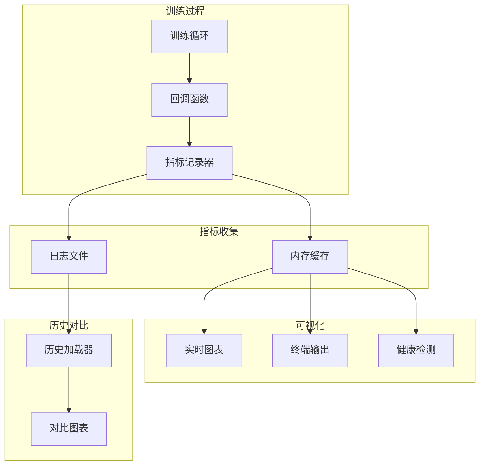

# 设计文档

## 概述

本设计文档描述实时训练预览功能的技术实现方案。通过收集训练过程中的各项指标，实时可视化 loss 曲线、准确率变化等，帮助开发者监控训练状态并及时发现问题。

## 架构



## 组件和接口

### 1. 指标记录器 (MetricsLogger)

```python
class 指标记录器:
    """记录训练过程中的各项指标"""
    
    def __init__(self, 日志目录: str = "日志/训练"):
        """
        初始化记录器
        
        参数:
            日志目录: 日志文件保存目录
        """
        pass
    
    def 记录批次(self, 批次: int, loss: float, **其他指标):
        """
        记录每个批次的指标
        
        参数:
            批次: 当前批次号
            loss: 损失值
            其他指标: 其他需要记录的指标
        """
        pass
    
    def 记录轮次(self, 轮次: int, 训练loss: float, 验证loss: float = None,
                 训练准确率: float = None, 验证准确率: float = None,
                 学习率: float = None):
        """
        记录每个轮次的指标
        
        参数:
            轮次: 当前轮次号
            训练loss: 训练损失
            验证loss: 验证损失
            训练准确率: 训练准确率
            验证准确率: 验证准确率
            学习率: 当前学习率
        """
        pass
    
    def 获取历史(self, 指标名: str) -> list:
        """获取指定指标的历史记录"""
        pass
    
    def 保存(self):
        """保存指标到文件"""
        pass
    
    def 加载(self, 日志路径: str):
        """从文件加载历史指标"""
        pass
```

### 2. 实时图表 (LiveChart)

```python
class 实时图表:
    """实时更新的训练曲线图"""
    
    def __init__(self, 更新间隔: int = 10, 图表配置: dict = None):
        """
        初始化实时图表
        
        参数:
            更新间隔: 每隔多少批次更新一次
            图表配置: 图表显示配置
        """
        pass
    
    def 启动(self):
        """启动图表窗口（非阻塞）"""
        pass
    
    def 更新(self, 指标记录器: 指标记录器):
        """
        更新图表数据
        
        参数:
            指标记录器: 包含最新数据的记录器
        """
        pass
    
    def 添加子图(self, 名称: str, 指标列表: list):
        """
        添加子图
        
        参数:
            名称: 子图名称
            指标列表: 要显示的指标名称列表
        """
        pass
    
    def 叠加历史(self, 历史数据: dict, 标签: str):
        """
        叠加历史训练数据
        
        参数:
            历史数据: 历史指标数据
            标签: 历史数据标签
        """
        pass
    
    def 关闭(self):
        """关闭图表窗口"""
        pass
```

### 3. 训练监控器 (TrainingMonitor)

```python
class 训练监控器:
    """监控训练健康状况"""
    
    class 状态(Enum):
        正常 = "normal"      # 绿色
        警告 = "warning"     # 黄色
        异常 = "abnormal"    # 红色
    
    def __init__(self, 配置: dict = None):
        """
        初始化监控器
        
        参数:
            配置: 监控配置（阈值等）
        """
        pass
    
    def 检查(self, 指标记录器: 指标记录器) -> tuple:
        """
        检查训练健康状况
        
        返回:
            (状态, 问题列表)
        """
        pass
    
    def 检测平台期(self, loss历史: list, 窗口: int = 10) -> bool:
        """
        检测 loss 是否停滞
        
        参数:
            loss历史: loss 历史记录
            窗口: 检测窗口大小
            
        返回:
            是否处于平台期
        """
        pass
    
    def 检测发散(self, loss历史: list, 窗口: int = 5) -> bool:
        """
        检测 loss 是否发散
        
        参数:
            loss历史: loss 历史记录
            窗口: 检测窗口大小
            
        返回:
            是否发散
        """
        pass
    
    def 检测尖峰(self, loss历史: list, 阈值: float = 3.0) -> bool:
        """
        检测 loss 尖峰
        
        参数:
            loss历史: loss 历史记录
            阈值: 标准差倍数阈值
            
        返回:
            是否有尖峰
        """
        pass
```

### 4. 终端输出器 (TerminalOutput)

```python
class 终端输出器:
    """优化的终端训练输出"""
    
    def __init__(self, 静默模式: bool = False):
        """
        初始化输出器
        
        参数:
            静默模式: 是否最小化输出
        """
        pass
    
    def 显示进度条(self, 当前: int, 总数: int, 前缀: str = ""):
        """显示进度条"""
        pass
    
    def 显示批次信息(self, 批次: int, loss: float, 速度: float):
        """
        显示批次信息
        
        参数:
            批次: 当前批次
            loss: 当前 loss
            速度: 每秒处理样本数
        """
        pass
    
    def 显示轮次摘要(self, 轮次: int, 训练loss: float, 验证loss: float,
                    训练准确率: float, 验证准确率: float, 耗时: float):
        """显示轮次结束摘要"""
        pass
    
    def 显示预计时间(self, 已完成: int, 总数: int, 已用时间: float):
        """显示预计剩余时间"""
        pass
    
    def 显示警告(self, 消息: str, 状态: 训练监控器.状态):
        """显示带颜色的警告信息"""
        pass
```

### 5. 训练回调 (TrainingCallback)

```python
class 可视化回调:
    """训练可视化回调函数"""
    
    def __init__(self, 启用图表: bool = True, 启用终端: bool = True,
                 更新间隔: int = 10):
        """
        初始化回调
        
        参数:
            启用图表: 是否启用实时图表
            启用终端: 是否启用终端输出
            更新间隔: 图表更新间隔
        """
        pass
    
    def on_train_begin(self, 总轮次: int, 每轮批次: int):
        """训练开始时调用"""
        pass
    
    def on_batch_end(self, 批次: int, loss: float, **指标):
        """每个批次结束时调用"""
        pass
    
    def on_epoch_end(self, 轮次: int, **指标):
        """每个轮次结束时调用"""
        pass
    
    def on_train_end(self):
        """训练结束时调用"""
        pass
```

## 数据模型

### 指标数据

```python
@dataclass
class 批次指标:
    批次: int
    loss: float
    时间戳: float

@dataclass
class 轮次指标:
    轮次: int
    训练loss: float
    验证loss: float
    训练准确率: float
    验证准确率: float
    学习率: float
    耗时: float
```

### 监控配置

```python
监控配置 = {
    "平台期检测": {
        "窗口": 10,
        "阈值": 0.001  # loss 变化小于此值视为停滞
    },
    "发散检测": {
        "窗口": 5,
        "阈值": 0.1  # loss 连续上升超过此值视为发散
    },
    "尖峰检测": {
        "阈值": 3.0  # 标准差倍数
    },
    "图表": {
        "更新间隔": 10,
        "子图": ["loss", "accuracy", "learning_rate"]
    }
}
```

## 正确性属性

### 属性 1: 非阻塞更新

*对于任意* 图表更新操作，不应阻塞训练主循环超过 100ms

**验证: 需求 2.5**

### 属性 2: 数据一致性

*对于任意* 保存的日志文件，重新加载后应与内存数据一致

**验证: 需求 1.5**

### 属性 3: 检测准确性

*对于任意* 连续 10 个 loss 值单调递增的序列，发散检测应返回 True

**验证: 需求 3.2**

## 错误处理

| 错误场景 | 处理策略 |
|---------|---------|
| 图表窗口关闭 | 继续训练，禁用图表更新 |
| 日志写入失败 | 警告并继续，数据保留在内存 |
| 历史文件损坏 | 警告并跳过历史对比 |
| 内存不足 | 清理旧数据，保留最近 N 条 |

## 测试策略

### 单元测试
- 测试指标记录和读取
- 测试健康检测算法
- 测试进度条显示

### 属性测试
- 属性 1: 模拟高频更新，验证延迟
- 属性 2: 随机生成指标，验证保存/加载一致性
- 属性 3: 生成各种 loss 序列，验证检测准确性
