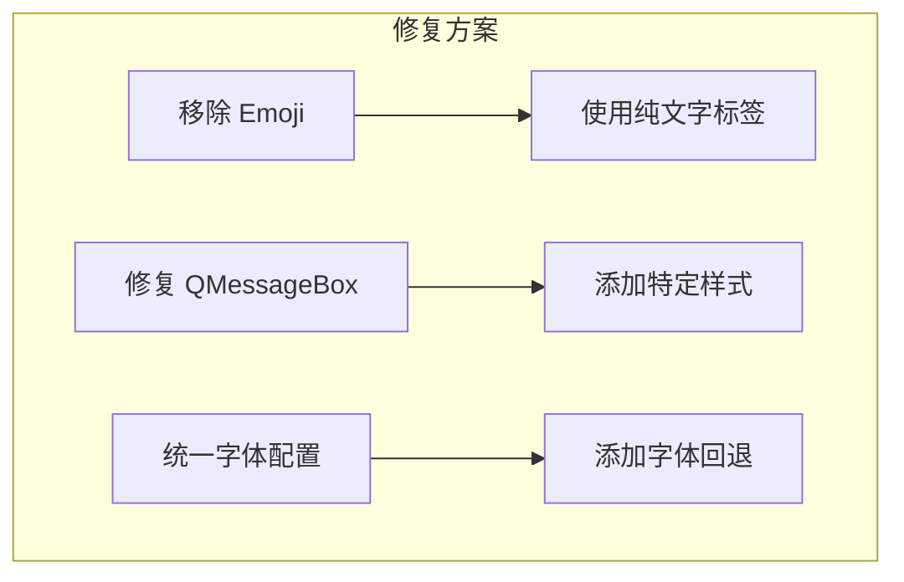

# 设计文档

## 概述

修复整个项目中 UI 文字和 emoji 无法正确显示的问题。主要问题包括：
1. Emoji 图标在 Windows 系统上显示为方框
2. QMessageBox 对话框按钮文字不可见
3. 部分标签文字颜色与背景对比度不足

## 问题分析

### 问题 1: Emoji 显示为方框

**原因**: Windows 系统默认字体 "Microsoft YaHei" 不完全支持 emoji 字符。当字体无法渲染 emoji 时，会显示为方框。

**影响范围**:
- 窗口标题: `🪟 选择游戏窗口`
- 搜索框占位符: `🔍 输入关键词过滤窗口...`
- 按钮文字: `🔄 刷新`, `🎯 点击选择`
- 分组标题: `🎯 检测参数`, `🔍 状态识别器`

**解决方案**: 
- 方案 A: 使用纯文字替代 emoji（推荐）
- 方案 B: 使用 Segoe UI Emoji 字体（Windows 10+）
- 方案 C: 使用图标字体（如 Font Awesome）

### 问题 2: QMessageBox 按钮文字不可见

**原因**: 全局 QSS 样式中的 QPushButton 样式覆盖了 QMessageBox 的默认按钮样式，导致按钮文字颜色与背景颜色相同或对比度不足。

**影响范围**:
- 所有 QMessageBox 对话框的按钮
- 确认对话框的"是"/"否"按钮

**解决方案**: 
- 为 QMessageBox 的按钮添加特定样式
- 或者排除 QMessageBox 按钮的全局样式

## 架构

### 修复策略



## 组件和接口

### 1. 主题文件修改 (界面/样式/主题.py)

添加 QMessageBox 按钮样式：

```python
# 在 LIGHT_THEME_QSS 中添加
/* ==================== 消息框 ==================== */
QMessageBox {
    background-color: #FFFFFF;
}

QMessageBox QLabel {
    color: #334155;
    font-size: 13px;
}

QMessageBox QPushButton {
    background-color: #3B82F6;
    color: white;
    border: none;
    border-radius: 6px;
    padding: 8px 20px;
    font-size: 12px;
    min-width: 80px;
    min-height: 32px;
}

QMessageBox QPushButton:hover {
    background-color: #2563EB;
}
```

### 2. 文字替代方案

将所有 emoji 替换为纯文字或符号：

| 原始 | 替换为 |
|------|--------|
| 🪟 | [窗口] 或 ■ |
| 🔍 | [搜索] 或 ○ |
| 🔄 | [刷新] 或 ↻ |
| 🎯 | [选择] 或 ◎ |
| 🖱️ | [点击] |
| ⚙️ | [设置] |
| 📐 | [区域] |
| 👁️ | [预览] |
| 🧠 | [模型] |
| 📚 | [训练] |
| 🚀 | [运行] |
| 📂 | [路径] |
| 🔧 | [选项] |
| 📝 | [日志] |
| 💾 | [保存] |
| ✓ | √ |
| ❌ | × |
| ⚠️ | ! |

### 3. 需要修改的文件列表

1. `界面/样式/主题.py` - 添加 QMessageBox 样式
2. `界面/组件/窗口选择器.py` - 替换 emoji
3. `界面/配置界面.py` - 替换 emoji
4. `界面/页面/配置页.py` - 替换 emoji
5. `界面/页面/数据管理页.py` - 替换 emoji
6. `界面/页面/数据收集页.py` - 替换 emoji
7. `界面/主程序.py` - 替换窗口标题 emoji
8. `界面/样式/布局常量.py` - 替换页面配置中的 emoji

## 正确性属性

### Property 1: 文字可见性

*对于任意* UI 组件的文字内容，该文字应在其背景上清晰可见（对比度足够）

**验证: 需求 3.1, 3.2**

### Property 2: 按钮文字显示

*对于任意* QPushButton 或 QMessageBox 按钮，其文字应正确显示且可读

**验证: 需求 3.3**

### Property 3: 标签文字显示

*对于任意* QLabel 组件，其文字应使用系统支持的字符，不显示方框

**验证: 需求 2.1, 2.2**

## 错误处理

| 错误场景 | 处理方式 |
|---------|---------|
| 字体不支持某字符 | 使用纯文字替代 |
| 样式冲突 | 使用更具体的选择器 |

## 测试策略

### 手动测试

1. 启动应用程序，检查所有页面标题是否正确显示
2. 打开窗口选择对话框，检查所有按钮和标签
3. 触发确认对话框，检查"是"/"否"按钮文字
4. 检查配置界面所有分组标题和按钮

### 验证清单

- [ ] 窗口选择对话框标题显示正确
- [ ] 搜索框占位符显示正确
- [ ] 刷新按钮文字显示正确
- [ ] 点击选择按钮文字显示正确
- [ ] 确认对话框按钮文字可见
- [ ] 配置界面所有分组标题显示正确
- [ ] 所有页面标题显示正确
