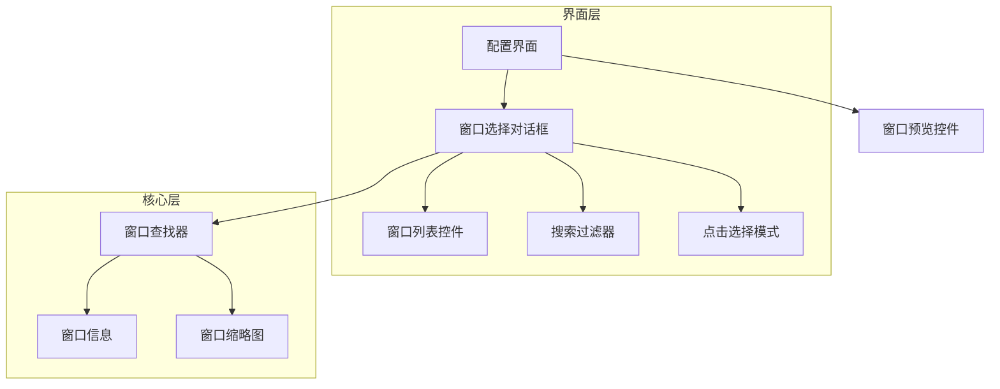
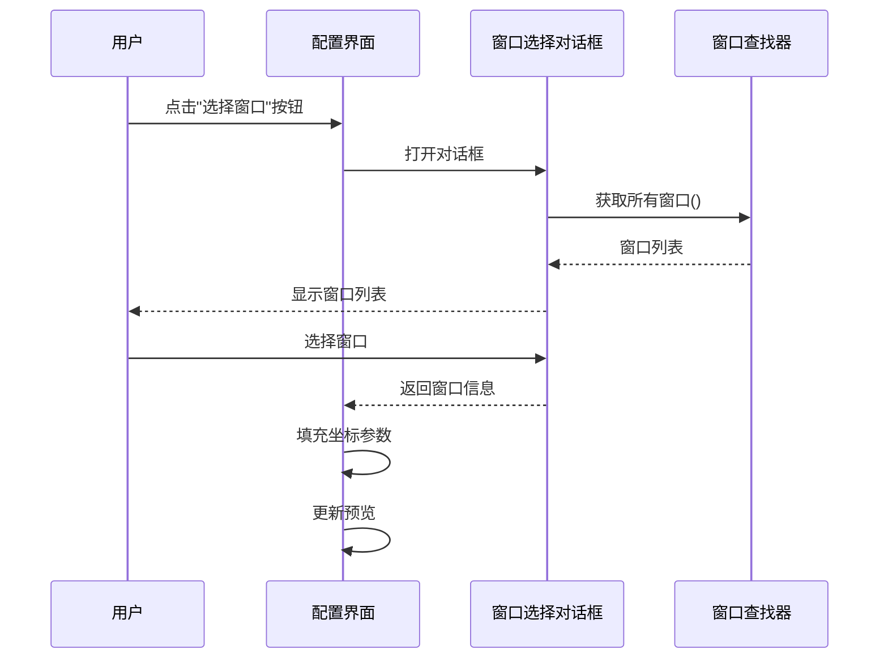

# 设计文档

## 概述

本设计实现配置界面中的窗口选择功能，通过创建一个窗口选择对话框组件，集成现有的 `窗口查找器` 模块，让用户可以从运行中的进程列表中选择目标窗口或通过点击选择模式来选取窗口。

## 架构

### 组件关系



### 数据流



## 组件和接口

### 窗口选择对话框 (WindowSelectorDialog)

新建 `界面/组件/窗口选择对话框.py`

```python
class 窗口选择对话框(QDialog):
    """窗口选择对话框
    
    提供窗口列表显示、搜索过滤、点击选择等功能
    
    信号:
        窗口已选择(窗口信息): 用户选择窗口后发出
    """
    
    窗口已选择 = Signal(object)  # 发送 窗口信息 对象
    
    def __init__(self, parent=None):
        """初始化对话框"""
        pass
    
    def _初始化界面(self):
        """初始化界面布局"""
        pass
    
    def _创建搜索区域(self) -> QWidget:
        """创建搜索输入区域"""
        pass
    
    def _创建窗口列表(self) -> QWidget:
        """创建窗口列表控件"""
        pass
    
    def _创建按钮区域(self) -> QWidget:
        """创建底部按钮区域"""
        pass
    
    def _刷新窗口列表(self):
        """刷新窗口列表"""
        pass
    
    def _过滤窗口列表(self, 关键词: str):
        """根据关键词过滤窗口列表"""
        pass
    
    def _启动点击选择模式(self):
        """启动点击选择模式"""
        pass
    
    def _处理窗口选择(self, 窗口信息):
        """处理窗口选择"""
        pass
    
    def 获取选中窗口(self) -> Optional[窗口信息]:
        """获取用户选中的窗口信息"""
        pass
```

### 窗口列表项控件 (WindowListItem)

```python
class 窗口列表项(QWidget):
    """窗口列表项控件
    
    显示单个窗口的信息，包括缩略图、标题、进程名、尺寸
    """
    
    def __init__(self, 窗口信息: 窗口信息, parent=None):
        """初始化列表项"""
        pass
    
    def _创建缩略图(self) -> QLabel:
        """创建缩略图显示"""
        pass
    
    def _创建信息区域(self) -> QWidget:
        """创建窗口信息显示区域"""
        pass
    
    def 设置选中状态(self, 选中: bool):
        """设置选中状态"""
        pass
```

### 配置界面修改

在 `界面/配置界面.py` 的 `_创建窗口设置标签页` 方法中添加选择窗口按钮：

```python
def _创建窗口设置标签页(self) -> QWidget:
    # ... 现有代码 ...
    
    # 添加选择窗口按钮
    选择窗口按钮 = QPushButton("🎯 选择窗口")
    选择窗口按钮.clicked.connect(self._打开窗口选择对话框)
    窗口组布局.addWidget(选择窗口按钮, 2, 0, 1, 2)
    
    # ... 现有代码 ...

def _打开窗口选择对话框(self):
    """打开窗口选择对话框"""
    from 界面.组件.窗口选择对话框 import 窗口选择对话框
    
    对话框 = 窗口选择对话框(self)
    if 对话框.exec() == QDialog.Accepted:
        窗口信息 = 对话框.获取选中窗口()
        if 窗口信息:
            self._填充窗口参数(窗口信息)

def _填充窗口参数(self, 窗口信息):
    """填充窗口参数到界面"""
    # 设置坐标和尺寸
    self._设置控件值_by_key("窗口设置.窗口X", 窗口信息.位置[0])
    self._设置控件值_by_key("窗口设置.窗口Y", 窗口信息.位置[1])
    self._设置控件值_by_key("窗口设置.窗口宽度", 窗口信息.大小[0])
    self._设置控件值_by_key("窗口设置.窗口高度", 窗口信息.大小[1])
    
    # 更新预览
    self.更新预览()
    
    # 标记已修改
    self._标记已修改()
```

## 数据模型

复用现有的 `核心/窗口检测.py` 中的数据类：

```python
@dataclass
class 窗口信息:
    """窗口信息数据类"""
    句柄: int
    标题: str
    进程名: str
    进程ID: int
    位置: Tuple[int, int]  # (x, y)
    大小: Tuple[int, int]  # (width, height)
    是否可见: bool = True
    是否最小化: bool = False
```

## 正确性属性

*正确性属性是在所有有效执行中都应该保持为真的特征或行为——本质上是关于系统应该做什么的正式声明。属性作为人类可读规范和机器可验证正确性保证之间的桥梁。*

### Property 1: 窗口列表完整性

*对于任意* 调用 `_刷新窗口列表()` 方法，返回的窗口列表应包含所有当前可见的窗口（不包括最小化窗口）

**验证: 需求 2.1**

### Property 2: 搜索过滤正确性

*对于任意* 搜索关键词，过滤后的窗口列表中的每个窗口的标题或进程名都应包含该关键词（不区分大小写）

**验证: 需求 3.2, 3.3**

### Property 3: 参数填充一致性

*对于任意* 选中的窗口信息，填充到配置界面后，窗口X、窗口Y、窗口宽度、窗口高度的值应与窗口信息中的位置和大小完全一致

**验证: 需求 5.1, 5.2, 5.3, 5.4**

### Property 4: 预览同步更新

*对于任意* 参数填充操作，窗口预览控件显示的区域应与填充的坐标参数一致

**验证: 需求 5.5**

## 错误处理

| 错误场景 | 处理方式 |
|---------|---------|
| 获取窗口列表失败 | 显示错误提示，允许重试 |
| 获取缩略图失败 | 显示默认占位图 |
| 点击选择模式超时 | 自动恢复对话框，显示提示 |
| 选中的窗口已关闭 | 提示用户重新选择 |

## 测试策略

### 单元测试

- 测试窗口列表过滤逻辑
- 测试参数填充逻辑
- 测试窗口信息数据转换

### 属性测试

- Property 2: 使用随机生成的窗口列表和搜索关键词，验证过滤结果的正确性
- Property 3: 使用随机生成的窗口信息，验证填充后的参数值一致性

### 集成测试

- 测试完整的窗口选择流程
- 测试点击选择模式
- 测试与配置界面的集成
