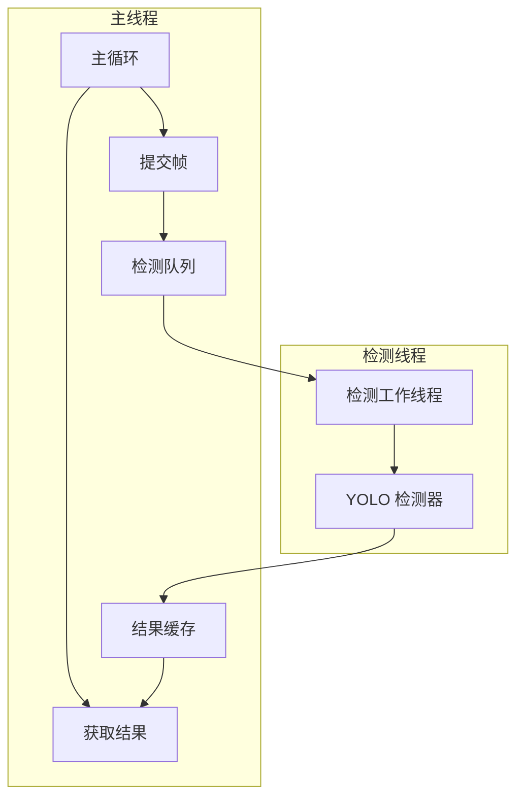

# 设计文档

## 概述

本设计文档描述 YOLO 异步检测功能的技术实现方案。通过将目标检测从主循环中分离到独立线程，避免阻塞决策循环，提高整体帧率。

## 架构



## 组件和接口

### 1. 异步检测器 (AsyncDetector)

```python
class 异步检测器:
    """异步 YOLO 目标检测器"""
    
    def __init__(self, 检测器: 'YOLO检测器', 
                 队列大小: int = 3,
                 检测间隔: int = 3):
        """
        初始化异步检测器
        
        参数:
            检测器: YOLO 检测器实例
            队列大小: 检测队列最大大小
            检测间隔: 每 N 帧检测一次
        """
        pass
    
    def 启动(self):
        """启动检测线程"""
        pass
    
    def 停止(self):
        """停止检测线程"""
        pass
    
    def 提交帧(self, 图像: np.ndarray) -> bool:
        """
        提交图像帧进行检测
        
        返回:
            是否成功提交（队列未满）
        """
        pass
    
    def 获取结果(self) -> List['检测结果']:
        """
        获取最新检测结果（非阻塞）
        
        返回:
            检测结果列表
        """
        pass
    
    def 获取统计(self) -> dict:
        """获取性能统计信息"""
        pass
```

### 2. 结果缓存 (ResultCache)

```python
class 结果缓存:
    """线程安全的检测结果缓存"""
    
    def __init__(self):
        self._结果: List['检测结果'] = []
        self._时间戳: float = 0.0
        self._锁 = threading.Lock()
    
    def 更新(self, 结果: List['检测结果']):
        """更新缓存结果"""
        pass
    
    def 获取(self) -> tuple:
        """
        获取缓存结果
        
        返回:
            (结果列表, 时间戳)
        """
        pass
    
    def 获取年龄(self) -> float:
        """获取缓存结果的年龄（秒）"""
        pass
```

### 3. 检测队列 (DetectionQueue)

```python
class 检测队列:
    """线程安全的检测任务队列"""
    
    def __init__(self, 最大大小: int = 3):
        self._队列 = queue.Queue(maxsize=最大大小)
        self._溢出计数 = 0
    
    def 放入(self, 图像: np.ndarray) -> bool:
        """
        放入图像帧
        
        返回:
            是否成功放入
        """
        pass
    
    def 取出(self, 超时: float = 1.0) -> np.ndarray:
        """取出图像帧（阻塞）"""
        pass
    
    def 获取溢出计数(self) -> int:
        """获取队列溢出次数"""
        pass
```

### 4. 性能监控器 (PerformanceMonitor)

```python
class 性能监控器:
    """检测性能监控"""
    
    def __init__(self, 窗口大小: int = 100):
        self._延迟记录 = deque(maxlen=窗口大小)
    
    def 记录延迟(self, 延迟: float):
        """记录一次检测延迟"""
        pass
    
    def 获取统计(self) -> dict:
        """
        获取统计信息
        
        返回:
            {平均延迟, 最小延迟, 最大延迟, 检测次数}
        """
        pass
```

## 数据模型

### 检测任务

```python
@dataclass
class 检测任务:
    图像: np.ndarray
    提交时间: float
    帧编号: int
```

### 性能统计

```python
@dataclass
class 性能统计:
    平均延迟: float  # 毫秒
    最小延迟: float
    最大延迟: float
    检测次数: int
    队列深度: int
    溢出次数: int
    缓存年龄: float  # 秒
```

## 正确性属性

### 属性 1: 线程安全性

*对于任意* 并发访问结果缓存的操作，不应产生数据竞争或不一致状态

**验证: 需求 4.1, 4.2**

### 属性 2: 结果时效性

*对于任意* 获取的检测结果，其时间戳应反映实际检测完成时间

**验证: 需求 2.3**

### 属性 3: 优雅关闭

*对于任意* 停止请求，检测线程应在合理时间内（< 1秒）完成关闭

**验证: 需求 1.5**

## 错误处理

| 错误场景 | 处理策略 |
|---------|---------|
| 检测线程异常 | 记录错误，继续运行 |
| 队列溢出 | 丢弃最旧帧，记录统计 |
| 检测超时 | 返回缓存结果 |
| 线程启动失败 | 回退到同步检测 |

## 测试策略

### 单元测试
- 测试队列操作
- 测试缓存读写
- 测试线程启停

### 属性测试
- 属性 1: 多线程并发访问测试
- 属性 2: 验证时间戳准确性
- 属性 3: 测试关闭响应时间
